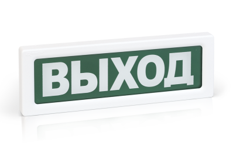

# Оповещатели
### Оповещатель взрывозащищенный адресный СКОПА-R

<table> 
  <thead> 
    <tr> 
      <th style="text-align: center">Параметр</th>
      <th style="text-align: center">Значение</th>
    </tr>
  </thead> 
  <tbody>
    <tr>
      <td style="text-align: left"><a href="/gk_manual/docs/docs/address_devices#краткое_название_устройства">Краткое название</a></td>
      <td style="text-align: center">Оповещатель пожарный комбинированный взрывозащищенный</td>
    </tr>
    <tr>
      <td style="text-align: left"><a href="/gk_manual/docs/address_devices#обозначение_устройства">Обозначение</a></td>
      <td style="text-align: center">СКОПА-R</td>
    </tr>
    <tr>
      <td style="text-align: left"><a href="/gk_manual/docs/address_devices#краткое_обозначение_устройства">Краткое обозначение</a></td>
      <td style="text-align: center">ОПК</td>
    </tr>
    <tr>
      <td style="text-align: left"><a href="/gk_manual/docs/address_devices#количество_адресов">Количество адресов</a></td>
      <td style="text-align: center">1</td>
    </tr>
    <tr>
      <td style="text-align: left"><a href="/gk_manual/docs/address_devices#устройство_противопожарной_защиты">УПЗ</a></td>
      <td style="text-align: center">Конфигурируется</td>
    </tr>
    <tr>
      <td style="text-align: left"><a href="/gk_manual/docs/address_devices#режимы-работы-ау">Режимы работы</a></td>
      <td style="text-align: center"><a href="/gk_manual/docs/address_devices#режим_работы_ау_дежурный">ДЕЖУРНЫЙ</a>, <a href="/gk_manual/docs/address_devices#режим_работы_ау_автоматика_отключена">АВТОМАТИКА ОТКЛЮЧЕНА</a>, <a href="/gk_manual/docs/address_devices#режим_работы_ау_отключено">ОТКЛЮЧЕНО</a> (если УПЗ=нет), <a href="/gk_manual/docs/address_devices#режим_работы_ау_блокировка_пуска">БЛОКИРОВКА ПУСКА</a> (если УПЗ=ДА)</td>
    </tr>
    <tr>
      <td style="text-align: left"><a href="/gk_manual/docs/address_devices#состояния-ау">Состояния</a></td>
      <td style="text-align: center"><a href="/gk_manual/docs/address_devices#состояние_ау_включено">включено</a>, <a href="/gk_manual/docs/address_devices#состояние_ау_включается">включается</a>, <a href="/gk_manual/docs/address_devices#состояние_ау_выключено">выключено</a>, <a href="/gk_manual/docs/address_devices#состояние_ау_выключается">выключается</a>,<a href="/gk_manual/docs/address_devices#состояние_ау_неисправно">неисправно</a>, <a href="/gk_manual/docs/address_devices#состояние_ау_отключено">отключено</a></td>
    </tr>    
  </tbody>
</table>

<a href="https://products.rubezh.ru/products/skopa_r2-3309/" target="_blank">На страницу продукта</a>

### Оповещатель охранно-пожарный звуковой адресный ОПОП 2-R2

|Наименование|Полное обозначение|Краткое обозначение|
|:---|:---:|:---:|
|Оповещатель пожарный звуковой|ОПОП 2|ОПЗ|

<a href="https://products.rubezh.ru/products/opop_2_r2-3380/" target="_blank">На страницу продукта</a>

### Оповещатель охранно-пожарный комбинированный свето-звуковой адресный ОПОП 124-R2

|Наименование|Полное обозначение|Краткое обозначение|
|:---|:---:|:---:|
|Оповещатель пожарный комбинированный|ОПОП 124|ОПК|

<a href="https://products.rubezh.ru/products/opop_124_r2-3370/" target="_blank">На страницу продукта</a>

### Оповещатель охранно-пожарный световой адресный ОПОП 1-R2

|Наименование|Полное обозначение|Краткое обозначение|
|:---|:---:|:---:|
|Оповещатель пожарный световой|ОПОП 1|ОПС|

<a href="https://products.rubezh.ru/products/opop_1_r2-3371/" target="_blank">На страницу продукта</a>

### Оповещатель светозвуковой взрывозащищенный пожарный адресный ЗОВ-R

|Наименование|Полное обозначение|Краткое обозначение|
|:---|:---:|:---:|
|Оповещатель пожарный комбинированный взрывозащищенный|ЗОВ-R|ОПК|

<a href="https://products.rubezh.ru/products/zov_r2-3328/" target="_blank">На страницу продукта</a>
