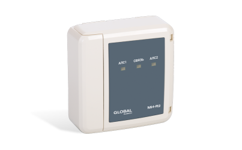
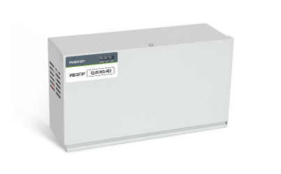
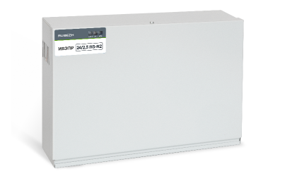

# Вспомогательные устройства
### Изолятор короткого замыкания МИ-R2

|Наименование|Полное обозначение|Краткое обозначение|
|:---|:---:|:---:|
|Изолятор короткого замыкания|МИ|МИ|

<a href="https://products.rubezh.ru/products/mi_r2_1-7076/" target="_blank">На страницу продукта</a>

### Изолятор короткого замыкания базовый МИБ-R2

|Наименование|Полное обозначение|Краткое обозначение|
|:---|:---:|:---:|
|Изолятор короткого замыкания базовый|МИБ|МИ|

<a href="https://products.rubezh.ru/products/mib_r2_1-7539/" target="_blank">На страницу продукта</a>

### Индикатор состояний ИС-R2

|Наименование|Полное обозначение|Краткое обозначение|
|:---|:---:|:---:|
|Индикатор состояний|ИС|ИС|

<a href="https://products.rubezh.ru/products/is_r2-3331/" target="_blank">На страницу продукта</a>

### Источник вторичного электропитания резервированный адресный ИВЭПР 12/2 RS-R2

|Наименование|Полное обозначение|Краткое обозначение|
|:---|:---:|:---:|
|Источник вторичного электропитания|ИВЭПР|ИВЭ|

<a href="https://products.rubezh.ru/products/ivepr_12_2_rs_r2-3341/" target="_blank">На страницу продукта</a>

### Источник вторичного электропитания резервированный адресный ИВЭПР 12/3,5 RS-R2

|Наименование|Полное обозначение|Краткое обозначение|
|:---|:---:|:---:|
|Источник вторичного электропитания|ИВЭПР|ИВЭ|

<a href="https://products.rubezh.ru/products/ivepr_12_3_5_rs_r2-3318/" target="_blank">На страницу продукта</a>

### Источник вторичного электропитания резервированный адресный ИВЭПР 12/5 RS-R2

|Наименование|Полное обозначение|Краткое обозначение|
|:---|:---:|:---:|
|Источник вторичного электропитания|ИВЭПР|ИВЭ|

<a href="https://products.rubezh.ru/products/ivepr_12_5_rs_r2-3319/" target="_blank">На страницу продукта</a>

### Источник вторичного электропитания резервированный адресный ИВЭПР 24/2,5 RS-R2

|Наименование|Полное обозначение|Краткое обозначение|
|:---|:---:|:---:|
|Источник вторичного электропитания|ИВЭПР|ИВЭ|

<a href="https://products.rubezh.ru/products/ivepr_24_2_5_rs_r2-3342/" target="_blank">На страницу продукта</a>

### Модуль ветвления и подпитки МВП-R2

|Наименование|Полное обозначение|Краткое обозначение|
|:---|:---:|:---:|
|Модуль ветвления и подпитки|МВП|ИМВПС|

<a href="https://products.rubezh.ru/products/mvp_r2-3372/" target="_blank">На страницу продукта</a>

### Модуль связи ведущий МСВ-R2

|Наименование|Полное обозначение|Краткое обозначение|
|:---|:---:|:---:|
|Модуль связи ведущий|МСВ|МСВ|

<a href="https://products.rubezh.ru/products/msv_r2-3315/" target="_blank">На страницу продукта</a>

### Модуль связи подчиненный МСП-R2

|Наименование|Полное обозначение|Краткое обозначение|
|:---|:---:|:---:|
|Модуль связи подчиненный|МСП|МСП|

<a href="https://products.rubezh.ru/products/msp_r2-3314/" target="_blank">На страницу продукта</a>
