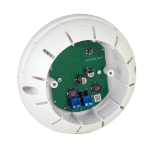
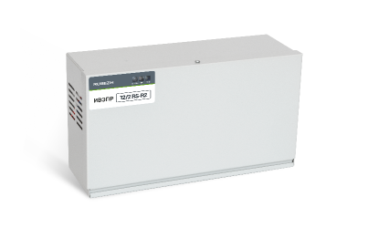
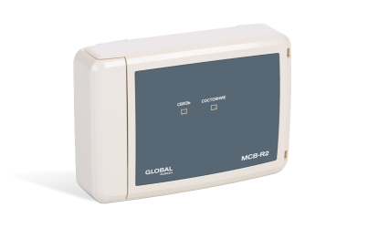

# Вспомогательные устройства
### Изолятор короткого замыкания МИ-R2

<table> 
  <thead> 
    <tr> 
      <th style="text-align: center">Параметр</th>
      <th style="text-align: center">Значение</th>
    </tr>
  </thead> 
  <tbody>
    <tr>
      <td style="text-align: left"><a href="/gk_manual/docs/docs/address_devices#краткое_название_устройства">Краткое название</a></td>
      <td style="text-align: center">Изолятор короткого замыкания</td>
    </tr>
    <tr>
      <td style="text-align: left"><a href="/gk_manual/docs/address_devices#обозначение_устройства">Обозначение</a></td>
      <td style="text-align: center">МИ</td>
    </tr>
    <tr>
      <td style="text-align: left"><a href="/gk_manual/docs/address_devices#краткое_обозначение_устройства">Краткое обозначение</a></td>
      <td style="text-align: center">МИ</td>
    </tr>
    <tr>
      <td style="text-align: left"><a href="/gk_manual/docs/address_devices#количество_адресов">Количество адресов</a></td>
      <td style="text-align: center">1</td>
    </tr>
    <tr>
      <td style="text-align: left"><a href="/gk_manual/docs/address_devices#устройство_противопожарной_защиты">УПЗ</a></td>
      <td style="text-align: center">Нет</td>
    </tr>
    <tr>
      <td style="text-align: left"><a href="/gk_manual/docs/address_devices#режимы-работы-ау">Режимы работы</a></td>
      <td style="text-align: center"><a href="/gk_manual/docs/address_devices#режим_работы_ау_дежурный">ДЕЖУРНЫЙ</a>, <a href="/gk_manual/docs/address_devices#режим_работы_ау_отключено">ОТКЛЮЧЕНО</a></td>
    </tr>
    <tr>
      <td style="text-align: left"><a href="/gk_manual/docs/address_devices#состояния-ау">Состояния</a></td>
      <td style="text-align: center"><a href="/gk_manual/docs/address_devices#состояние_ау_норма">норма</a>, <a href="/gk_manual/docs/address_devices#состояние_ау_неисправно">неисправно</a>, <a href="/gk_manual/docs/address_devices#состояние_ау_отключено">отключено</a></td>
    </tr>    
  </tbody>
</table>

<a href="https://products.rubezh.ru/products/mi_r2_1-7076/" target="_blank">На страницу продукта</a>

### Изолятор короткого замыкания базовый МИБ-R2

<table> 
  <thead> 
    <tr> 
      <th style="text-align: center">Параметр</th>
      <th style="text-align: center">Значение</th>
    </tr>
  </thead> 
  <tbody>
    <tr>
      <td style="text-align: left"><a href="/gk_manual/docs/docs/address_devices#краткое_название_устройства">Краткое название</a></td>
      <td style="text-align: center">Изолятор короткого замыкания базовый</td>
    </tr>
    <tr>
      <td style="text-align: left"><a href="/gk_manual/docs/address_devices#обозначение_устройства">Обозначение</a></td>
      <td style="text-align: center">МИБ</td>
    </tr>
    <tr>
      <td style="text-align: left"><a href="/gk_manual/docs/address_devices#краткое_обозначение_устройства">Краткое обозначение</a></td>
      <td style="text-align: center">МИ</td>
    </tr>
    <tr>
      <td style="text-align: left"><a href="/gk_manual/docs/address_devices#количество_адресов">Количество адресов</a></td>
      <td style="text-align: center">1</td>
    </tr>
    <tr>
      <td style="text-align: left"><a href="/gk_manual/docs/address_devices#устройство_противопожарной_защиты">УПЗ</a></td>
      <td style="text-align: center">Нет</td>
    </tr>
    <tr>
      <td style="text-align: left"><a href="/gk_manual/docs/address_devices#режимы-работы-ау">Режимы работы</a></td>
      <td style="text-align: center"><a href="/gk_manual/docs/address_devices#режим_работы_ау_дежурный">ДЕЖУРНЫЙ</a>, <a href="/gk_manual/docs/address_devices#режим_работы_ау_отключено">ОТКЛЮЧЕНО</a></td>
    </tr>
    <tr>
      <td style="text-align: left"><a href="/gk_manual/docs/address_devices#состояния-ау">Состояния</a></td>
      <td style="text-align: center"><a href="/gk_manual/docs/address_devices#состояние_ау_норма">норма</a>, <a href="/gk_manual/docs/address_devices#состояние_ау_неисправно">неисправно</a>, <a href="/gk_manual/docs/address_devices#состояние_ау_отключено">отключено</a></td>
    </tr>   
  </tbody>
</table>

<a href="https://products.rubezh.ru/products/mib_r2_1-7539/" target="_blank">На страницу продукта</a>

### Индикатор состояний ИС-R2

<table> 
  <thead> 
    <tr> 
      <th style="text-align: center">Параметр</th>
      <th style="text-align: center">Значение</th>
    </tr>
  </thead> 
  <tbody>
    <tr>
      <td style="text-align: left"><a href="/gk_manual/docs/docs/address_devices#краткое_название_устройства">Краткое название</a></td>
      <td style="text-align: center">Индикатор состояний</td>
    </tr>
    <tr>
      <td style="text-align: left"><a href="/gk_manual/docs/address_devices#обозначение_устройства">Обозначение</a></td>
      <td style="text-align: center">ИС</td>
    </tr>
    <tr>
      <td style="text-align: left"><a href="/gk_manual/docs/address_devices#краткое_обозначение_устройства">Краткое обозначение</a></td>
      <td style="text-align: center">ИС</td>
    </tr>
    <tr>
      <td style="text-align: left"><a href="/gk_manual/docs/address_devices#количество_адресов">Количество адресов</a></td>
      <td style="text-align: center">1</td>
    </tr>
    <tr>
      <td style="text-align: left"><a href="/gk_manual/docs/address_devices#устройство_противопожарной_защиты">УПЗ</a></td>
      <td style="text-align: center">Нет</td>
    </tr>
    <tr>
      <td style="text-align: left"><a href="/gk_manual/docs/address_devices#режимы-работы-ау">Режимы работы</a></td>
      <td style="text-align: center"><a href="/gk_manual/docs/address_devices#режим_работы_ау_дежурный">ДЕЖУРНЫЙ</a>, <a href="/gk_manual/docs/address_devices#режим_работы_ау_автоматика_отключена">АВТОМАТИКА ОТКЛЮЧЕНА</a>, <a href="/gk_manual/docs/address_devices#режим_работы_ау_отключено">ОТКЛЮЧЕНО</a></td>
    </tr>
    <tr>
      <td style="text-align: left"><a href="/gk_manual/docs/address_devices#состояния-ау">Состояния</a></td>
      <td style="text-align: center"><a href="/gk_manual/docs/address_devices#состояние_ау_норма">норма</a>, <a href="/gk_manual/docs/address_devices#состояние_ау_неисправно">неисправно</a>, <a href="/gk_manual/docs/address_devices#состояние_ау_отключено">отключено</a></td>
    </tr>    
  </tbody>
</table>

<a href="https://products.rubezh.ru/products/is_r2-3331/" target="_blank">На страницу продукта</a>

### Источник вторичного электропитания резервированный адресный ИВЭПР (12/2 RS-R2, 12/3,5 RS-R2, 12/5 RS-R2, 24/2,5 RS-R2)

<table> 
  <thead> 
    <tr> 
      <th style="text-align: center">Параметр</th>
      <th style="text-align: center">Значение</th>
    </tr>
  </thead> 
  <tbody>
    <tr>
      <td style="text-align: left"><a href="/gk_manual/docs/docs/address_devices#краткое_название_устройства">Краткое название</a></td>
      <td style="text-align: center">Источник вторичного электропитания</td>
    </tr>
    <tr>
      <td style="text-align: left"><a href="/gk_manual/docs/address_devices#обозначение_устройства">Обозначение</a></td>
      <td style="text-align: center">ИВЭПР</td>
    </tr>
    <tr>
      <td style="text-align: left"><a href="/gk_manual/docs/address_devices#краткое_обозначение_устройства">Краткое обозначение</a></td>
      <td style="text-align: center">ИВЭ</td>
    </tr>
    <tr>
      <td style="text-align: left"><a href="/gk_manual/docs/address_devices#количество_адресов">Количество адресов</a></td>
      <td style="text-align: center">1</td>
    </tr>
    <tr>
      <td style="text-align: left"><a href="/gk_manual/docs/address_devices#устройство_противопожарной_защиты">УПЗ</a></td>
      <td style="text-align: center">Нет</td>
    </tr>
    <tr>
      <td style="text-align: left"><a href="/gk_manual/docs/address_devices#режимы-работы-ау">Режимы работы</a></td>
      <td style="text-align: center"><a href="/gk_manual/docs/address_devices#режим_работы_ау_дежурный">ДЕЖУРНЫЙ</a>, <a href="/gk_manual/docs/address_devices#режим_работы_ау_отключено">ОТКЛЮЧЕНО</a></td>
    </tr>
    <tr>
      <td style="text-align: left"><a href="/gk_manual/docs/address_devices#состояния-ау">Состояния</a></td>
      <td style="text-align: center"><a href="/gk_manual/docs/address_devices#состояние_ау_норма">норма</a>, <a href="/gk_manual/docs/address_devices#состояние_ау_неисправно">неисправно</a>, <a href="/gk_manual/docs/address_devices#состояние_ау_отключено">отключено</a></td>
    </tr>    
  </tbody>
</table>

<a href="https://products.rubezh.ru/products/ivepr_12_2_rs_r2-3341/" target="_blank">На страницу продукта</a>

### Модуль ветвления и подпитки МВП-R2

<table> 
  <thead> 
    <tr> 
      <th style="text-align: center">Параметр</th>
      <th style="text-align: center">Значение</th>
    </tr>
  </thead> 
  <tbody>
    <tr>
      <td style="text-align: left"><a href="/gk_manual/docs/docs/address_devices#краткое_название_устройства">Краткое название</a></td>
      <td style="text-align: center">Модуль ветвления и подпитки</td>
    </tr>
    <tr>
      <td style="text-align: left"><a href="/gk_manual/docs/address_devices#обозначение_устройства">Обозначение</a></td>
      <td style="text-align: center">МВП</td>
    </tr>
    <tr>
      <td style="text-align: left"><a href="/gk_manual/docs/address_devices#краткое_обозначение_устройства">Краткое обозначение</a></td>
      <td style="text-align: center">МВП</td>
    </tr>
    <tr>
      <td style="text-align: left"><a href="/gk_manual/docs/address_devices#количество_адресов">Количество адресов</a></td>
      <td style="text-align: center">1</td>
    </tr>
    <tr>
      <td style="text-align: left"><a href="/gk_manual/docs/address_devices#устройство_противопожарной_защиты">УПЗ</a></td>
      <td style="text-align: center">Нет</td>
    </tr>
    <tr>
      <td style="text-align: left"><a href="/gk_manual/docs/address_devices#режимы-работы-ау">Режимы работы</a></td>
      <td style="text-align: center"><a href="/gk_manual/docs/address_devices#режим_работы_ау_дежурный">ДЕЖУРНЫЙ</a>, <a href="/gk_manual/docs/address_devices#режим_работы_ау_отключено">ОТКЛЮЧЕНО</a></td>
    </tr>
    <tr>
      <td style="text-align: left"><a href="/gk_manual/docs/address_devices#состояния-ау">Состояния</a></td>
      <td style="text-align: center"><a href="/gk_manual/docs/address_devices#состояние_ау_неисправно">неисправно</a>, <a href="/gk_manual/docs/address_devices#состояние_ау_отключено">отключено</a></td>
    </tr>    
  </tbody>
</table>

<a href="https://products.rubezh.ru/products/mvp_r2-3372/" target="_blank">На страницу продукта</a>

### Модуль связи ведущий МСВ-R2

<table> 
  <thead> 
    <tr> 
      <th style="text-align: center">Параметр</th>
      <th style="text-align: center">Значение</th>
    </tr>
  </thead> 
  <tbody>
    <tr>
      <td style="text-align: left"><a href="/gk_manual/docs/docs/address_devices#краткое_название_устройства">Краткое название</a></td>
      <td style="text-align: center">Модуль связи ведущий</td>
    </tr>
    <tr>
      <td style="text-align: left"><a href="/gk_manual/docs/address_devices#обозначение_устройства">Обозначение</a></td>
      <td style="text-align: center">МСВ</td>
    </tr>
    <tr>
      <td style="text-align: left"><a href="/gk_manual/docs/address_devices#краткое_обозначение_устройства">Краткое обозначение</a></td>
      <td style="text-align: center">МСВ</td>
    </tr>
    <tr>
      <td style="text-align: left"><a href="/gk_manual/docs/address_devices#количество_адресов">Количество адресов</a></td>
      <td style="text-align: center">1</td>
    </tr>
    <tr>
      <td style="text-align: left"><a href="/gk_manual/docs/address_devices#устройство_противопожарной_защиты">УПЗ</a></td>
      <td style="text-align: center">Нет</td>
    </tr>
    <tr>
      <td style="text-align: left"><a href="/gk_manual/docs/address_devices#режимы-работы-ау">Режимы работы</a></td>
      <td style="text-align: center"><a href="/gk_manual/docs/address_devices#режим_работы_ау_дежурный">ДЕЖУРНЫЙ</a>, <a href="/gk_manual/docs/address_devices#режим_работы_ау_отключено">ОТКЛЮЧЕНО</a></td>
    </tr>
    <tr>
      <td style="text-align: left"><a href="/gk_manual/docs/address_devices#состояния-ау">Состояния</a></td>
      <td style="text-align: center"><a href="/gk_manual/docs/address_devices#состояние_ау_норма">норма</a>, <a href="/gk_manual/docs/address_devices#состояние_ау_неисправно">неисправно</a>, <a href="/gk_manual/docs/address_devices#состояние_ау_отключено">отключено</a></td>
    </tr>    
  </tbody>
</table>

<a href="https://products.rubezh.ru/products/msv_r2-3315/" target="_blank">На страницу продукта</a>

### Модуль связи подчиненный МСП-R2

<table> 
  <thead> 
    <tr> 
      <th style="text-align: center">Параметр</th>
      <th style="text-align: center">Значение</th>
    </tr>
  </thead> 
  <tbody>
    <tr>
      <td style="text-align: left"><a href="/gk_manual/docs/docs/address_devices#краткое_название_устройства">Краткое название</a></td>
      <td style="text-align: center">Модуль связи подчиненный</td>
    </tr>
    <tr>
      <td style="text-align: left"><a href="/gk_manual/docs/address_devices#обозначение_устройства">Обозначение</a></td>
      <td style="text-align: center">МСП</td>
    </tr>
    <tr>
      <td style="text-align: left"><a href="/gk_manual/docs/address_devices#краткое_обозначение_устройства">Краткое обозначение</a></td>
      <td style="text-align: center">МСП</td>
    </tr>
    <tr>
      <td style="text-align: left"><a href="/gk_manual/docs/address_devices#количество_адресов">Количество адресов</a></td>
      <td style="text-align: center">1</td>
    </tr>
    <tr>
      <td style="text-align: left"><a href="/gk_manual/docs/address_devices#устройство_противопожарной_защиты">УПЗ</a></td>
      <td style="text-align: center">Нет</td>
    </tr>
    <tr>
      <td style="text-align: left"><a href="/gk_manual/docs/address_devices#режимы-работы-ау">Режимы работы</a></td>
      <td style="text-align: center"><a href="/gk_manual/docs/address_devices#режим_работы_ау_дежурный">ДЕЖУРНЫЙ</a>, <a href="/gk_manual/docs/address_devices#режим_работы_ау_отключено">ОТКЛЮЧЕНО</a></td>
    </tr>
    <tr>
      <td style="text-align: left"><a href="/gk_manual/docs/address_devices#состояния-ау">Состояния</a></td>
      <td style="text-align: center"><a href="/gk_manual/docs/address_devices#состояние_ау_норма">норма</a>, <a href="/gk_manual/docs/address_devices#состояние_ау_неисправно">неисправно</a>, <a href="/gk_manual/docs/address_devices#состояние_ау_отключено">отключено</a></td>
    </tr>    
  </tbody>
</table>

<a href="https://products.rubezh.ru/products/msp_r2-3314/" target="_blank">На страницу продукта</a>
