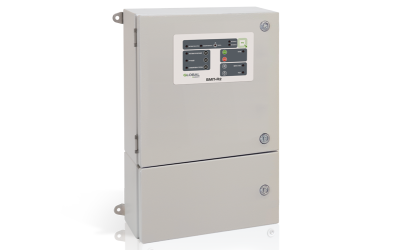
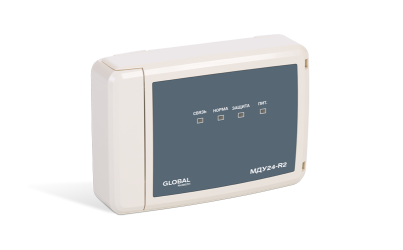
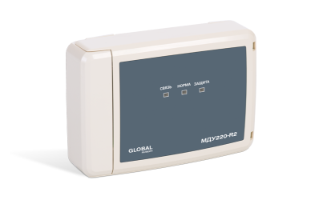
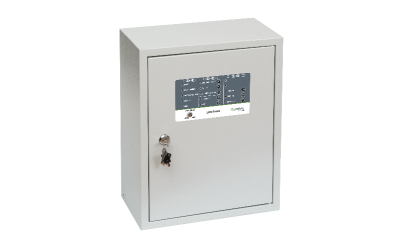
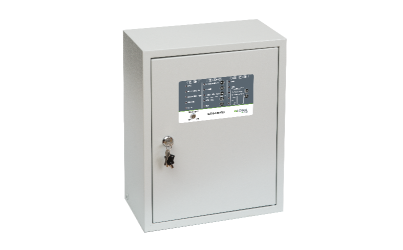

# Устройства управления
### Блок модульного пожаротушения БМП-R2

<table> 
  <thead> 
    <tr> 
      <th style="text-align: center">Параметр</th>
      <th style="text-align: center">Значение</th>
    </tr>
  </thead> 
  <tbody>
    <tr>
      <td style="text-align: left"><a href="/gk_manual/docs/docs/address_devices#краткое_название_устройства">Краткое название</a></td>
      <td style="text-align: center">Блок модульного пожаротушения</td>
    </tr>
    <tr>
      <td style="text-align: left"><a href="/gk_manual/docs/address_devices#обозначение_устройства">Обозначение</a></td>
      <td style="text-align: center">БМП</td>
    </tr>
    <tr>
      <td style="text-align: left"><a href="/gk_manual/docs/address_devices#краткое_обозначение_устройства">Краткое обозначение</a></td>
      <td style="text-align: center">БМП</td>
    </tr>
    <tr>
      <td style="text-align: left"><a href="/gk_manual/docs/address_devices#количество_адресов">Количество адресов</a></td>
      <td style="text-align: center">5</td>
    </tr>
    <tr>
      <td style="text-align: left"><a href="/gk_manual/docs/address_devices#устройство_противопожарной_защиты">УПЗ</a></td>
      <td style="text-align: center">Да</td>
    </tr>
    <tr>
      <td style="text-align: left"><a href="/gk_manual/docs/address_devices#режимы-работы-ау">Режимы работы</a></td>
      <td style="text-align: center"><a href="/gk_manual/docs/address_devices#режим_работы_ау_дежурный">ДЕЖУРНЫЙ</a>, <a href="/gk_manual/docs/address_devices#режим_работы_ау_автоматика_отключена">АВТОМАТИКА ОТКЛЮЧЕНА</a>, <a href="/gk_manual/docs/address_devices#режим_работы_ау_блокировка_пуска">БЛОКИРОВКА ПУСКА</a></td>
    </tr>
    <tr>
      <td style="text-align: left"><a href="/gk_manual/docs/address_devices#состояния-ау">Состояния</a></td>
      <td style="text-align: center"><a href="/gk_manual/docs/address_devices#состояние_ау_включено">включено</a>, <a href="/gk_manual/docs/address_devices#состояние_ау_включается">включается</a>, <a href="/gk_manual/docs/address_devices#состояние_ау_выключено">выключено</a>, <a href="/gk_manual/docs/address_devices#состояние_ау_неисправно">неисправно</a></td>
    </tr>    
  </tbody>
</table>

<a href="https://products.rubezh.ru/products/bmp_r2-3326/" target="_blank">На страницу продукта</a>

### Модуль автоматики дымоудаления МДУ-R2 исп. 24

<table> 
  <thead> 
    <tr> 
      <th style="text-align: center">Параметр</th>
      <th style="text-align: center">Значение</th>
    </tr>
  </thead> 
  <tbody>
    <tr>
      <td style="text-align: left"><a href="/gk_manual/docs/docs/address_devices#краткое_название_устройства">Краткое название</a></td>
      <td style="text-align: center">Модуль автоматики дымоудаления</td>
    </tr>
    <tr>
      <td style="text-align: left"><a href="/gk_manual/docs/address_devices#обозначение_устройства">Обозначение</a></td>
      <td style="text-align: center">МДУ исп. 24</td>
    </tr>
    <tr>
      <td style="text-align: left"><a href="/gk_manual/docs/address_devices#краткое_обозначение_устройства">Краткое обозначение</a></td>
      <td style="text-align: center">МДУ</td>
    </tr>
    <tr>
      <td style="text-align: left"><a href="/gk_manual/docs/address_devices#количество_адресов">Количество адресов</a></td>
      <td style="text-align: center">1</td>
    </tr>
    <tr>
      <td style="text-align: left"><a href="/gk_manual/docs/address_devices#устройство_противопожарной_защиты">УПЗ</a></td>
      <td style="text-align: center">Да</td>
    </tr>
    <tr>
      <td style="text-align: left"><a href="/gk_manual/docs/address_devices#режимы-работы-ау">Режимы работы</a></td>
      <td style="text-align: center"><a href="/gk_manual/docs/address_devices#режим_работы_ау_дежурный">ДЕЖУРНЫЙ</a>, <a href="/gk_manual/docs/address_devices#режим_работы_ау_автоматика_отключена">АВТОМАТИКА ОТКЛЮЧЕНА</a>, <a href="/gk_manual/docs/address_devices#режим_работы_ау_блокировка_пуска">БЛОКИРОВКА ПУСКА</a></td>
    </tr>
    <tr>
      <td style="text-align: left"><a href="/gk_manual/docs/address_devices#состояния-ау">Состояния</a></td>
      <td style="text-align: center"><a href="/gk_manual/docs/address_devices#состояние_ау_включено">включено</a>, <a href="/gk_manual/docs/address_devices#состояние_ау_включается">включается</a>, <a href="/gk_manual/docs/address_devices#состояние_ау_выключено">выключено</a>, <a href="/gk_manual/docs/address_devices#состояние_ау_выключается">выключается</a>, <a href="/gk_manual/docs/address_devices#состояние_ау_неисправно">неисправно</a></td>
    </tr>    
  </tbody>
</table>

<a href="https://products.rubezh.ru/products/mdu_r2_isp_24-3362/" target="_blank">На страницу продукта</a>

### Модуль автоматики дымоудаления МДУ-R2 исп. 220

<table> 
  <thead> 
    <tr> 
      <th style="text-align: center">Параметр</th>
      <th style="text-align: center">Значение</th>
    </tr>
  </thead> 
  <tbody>
    <tr>
      <td style="text-align: left"><a href="/gk_manual/docs/docs/address_devices#краткое_название_устройства">Краткое название</a></td>
      <td style="text-align: center">Модуль автоматики дымоудаления</td>
    </tr>
    <tr>
      <td style="text-align: left"><a href="/gk_manual/docs/address_devices#обозначение_устройства">Обозначение</a></td>
      <td style="text-align: center">МДУ исп. 220</td>
    </tr>
    <tr>
      <td style="text-align: left"><a href="/gk_manual/docs/address_devices#краткое_обозначение_устройства">Краткое обозначение</a></td>
      <td style="text-align: center">МДУ</td>
    </tr>
    <tr>
      <td style="text-align: left"><a href="/gk_manual/docs/address_devices#количество_адресов">Количество адресов</a></td>
      <td style="text-align: center">1</td>
    </tr>
    <tr>
      <td style="text-align: left"><a href="/gk_manual/docs/address_devices#устройство_противопожарной_защиты">УПЗ</a></td>
      <td style="text-align: center">Да</td>
    </tr>
    <tr>
      <td style="text-align: left"><a href="/gk_manual/docs/address_devices#режимы-работы-ау">Режимы работы</a></td>
      <td style="text-align: center"><a href="/gk_manual/docs/address_devices#режим_работы_ау_дежурный">ДЕЖУРНЫЙ</a>, <a href="/gk_manual/docs/address_devices#режим_работы_ау_автоматика_отключена">АВТОМАТИКА ОТКЛЮЧЕНА</a>, <a href="/gk_manual/docs/address_devices#режим_работы_ау_блокировка_пуска">БЛОКИРОВКА ПУСКА</a></td>
    </tr>
    <tr>
      <td style="text-align: left"><a href="/gk_manual/docs/address_devices#состояния-ау">Состояния</a></td>
      <td style="text-align: center"><a href="/gk_manual/docs/address_devices#состояние_ау_включено">включено</a>, <a href="/gk_manual/docs/address_devices#состояние_ау_включается">включается</a>, <a href="/gk_manual/docs/address_devices#состояние_ау_выключено">выключено</a>, <a href="/gk_manual/docs/address_devices#состояние_ау_выключается">выключается</a>, <a href="/gk_manual/docs/address_devices#состояние_ау_неисправно">неисправно</a></td>
    </tr>    
  </tbody>
</table>

<a href="https://products.rubezh.ru/products/mdu_r2_isp_220-3363/" target="_blank">На страницу продукта</a>

### Шкаф управления задвижкой ШУЗ-R2

<table> 
  <thead> 
    <tr> 
      <th style="text-align: center">Параметр</th>
      <th style="text-align: center" colspan="3">Значение</th>
    </tr>
  </thead> 
  <tbody>
    <tr>
      <td style="text-align: left"><a href="/gk_manual/docs/docs/address_devices#краткое_название_устройства">Краткое название</a></td>
      <td style="text-align: center">Шкаф управления задвижкой с дисковым затвором</td>
      <td style="text-align: center">Шкаф управления задвижкой с шаровым затвором</td>
      <td style="text-align: center">Шкаф управления задвижкой с шаровым затвором и датчиками уровня</td>      
    </tr>
    <tr>
      <td style="text-align: left"><a href="/gk_manual/docs/address_devices#обозначение_устройства">Обозначение</a></td>
      <td style="text-align: center">ШУЗ КВ-МВ</td>
      <td style="text-align: center">ШУЗ КВ</td>
      <td style="text-align: center">ШУЗ КВ-ДУ</td>      
    </tr>
    <tr>
      <td style="text-align: left"><a href="/gk_manual/docs/address_devices#краткое_обозначение_устройства">Краткое обозначение</a></td>
      <td style="text-align: center" colspan="3">ШУ</td>
    </tr>
    <tr>
      <td style="text-align: left"><a href="/gk_manual/docs/address_devices#количество_адресов">Количество адресов</a></td>
      <td style="text-align: center" colspan="3">1</td>
    </tr>
    <tr>
      <td style="text-align: left"><a href="/gk_manual/docs/address_devices#устройство_противопожарной_защиты">УПЗ</a></td>
      <td style="text-align: center" colspan="3">Да</td>
    </tr>
    <tr>
      <td style="text-align: left"><a href="/gk_manual/docs/address_devices#режимы-работы-ау">Режимы работы</a></td>
      <td style="text-align: center" colspan="3"><a href="/gk_manual/docs/address_devices#режим_работы_ау_дежурный">ДЕЖУРНЫЙ</a>, <a href="/gk_manual/docs/address_devices#режим_работы_ау_автоматика_отключена">АВТОМАТИКА ОТКЛЮЧЕНА</a>, <a href="/gk_manual/docs/address_devices#режим_работы_ау_блокировка_пуска">БЛОКИРОВКА ПУСКА</a></td>
    </tr>
    <tr>
      <td style="text-align: left"><a href="/gk_manual/docs/address_devices#состояния-ау">Состояния</a></td>
      <td style="text-align: center" colspan="3"><a href="/gk_manual/docs/address_devices#состояние_ау_включено">включено</a>, <a href="/gk_manual/docs/address_devices#состояние_ау_включается">включается</a>, <a href="/gk_manual/docs/address_devices#состояние_ау_выключено">выключено</a>, <a href="/gk_manual/docs/address_devices#состояние_ау_неисправно">неисправно</a></td>
    </tr>    
  </tbody>
</table>

<a href="https://products.rubezh.ru/products/shuz_r2-3357/" target="_blank">На страницу продукта</a>

### Шкаф управления насосом или вентилятором ШУН/В-R2

<table> 
  <thead> 
    <tr> 
      <th style="text-align: center">Параметр</th>
      <th style="text-align: center" colspan="4">Значение</th>
    </tr>
  </thead> 
  <tbody>
    <tr>
      <td style="text-align: left"><a href="/gk_manual/docs/docs/address_devices#краткое_название_устройства">Краткое название</a></td>
      <td style="text-align: center">Шкаф управления вентилятором</td>
      <td style="text-align: center">Шкаф управления дренажным насосом</td>
      <td style="text-align: center">Шкаф управления жокей насосом</td>
      <td style="text-align: center">Шкаф управления пожарным насосом</td>
    </tr>
    <tr>
      <td style="text-align: left"><a href="/gk_manual/docs/address_devices#обозначение_устройства">Обозначение</a></td>
      <td style="text-align: center">ШУВ</td>
      <td style="text-align: center">ШУН ДН</td>
      <td style="text-align: center">ШУН ЖН</td>
      <td style="text-align: center">ШУН ПН</td>
    </tr>
    <tr>
      <td style="text-align: left"><a href="/gk_manual/docs/address_devices#краткое_обозначение_устройства">Краткое обозначение</a></td>
      <td style="text-align: center" colspan="4">ШУ</td>
    </tr>
    <tr>
      <td style="text-align: left"><a href="/gk_manual/docs/address_devices#количество_адресов">Количество адресов</a></td>
      <td style="text-align: center" colspan="4">1</td>
    </tr>
    <tr>
      <td style="text-align: left"><a href="/gk_manual/docs/address_devices#устройство_противопожарной_защиты">УПЗ</a></td>
      <td style="text-align: center" colspan="4">Да</td>
    </tr>
    <tr>
      <td style="text-align: left"><a href="/gk_manual/docs/address_devices#режимы-работы-ау">Режимы работы</a></td>
      <td style="text-align: center" colspan="4"><a href="/gk_manual/docs/address_devices#режим_работы_ау_дежурный">ДЕЖУРНЫЙ</a>, <a href="/gk_manual/docs/address_devices#режим_работы_ау_автоматика_отключена">АВТОМАТИКА ОТКЛЮЧЕНА</a>, <a href="/gk_manual/docs/address_devices#режим_работы_ау_блокировка_пуска">БЛОКИРОВКА ПУСКА</a></td>
    </tr>
    <tr>
      <td style="text-align: left"><a href="/gk_manual/docs/address_devices#состояния-ау">Состояния</a></td>
      <td style="text-align: center" colspan="4"><a href="/gk_manual/docs/address_devices#состояние_ау_включено">включено</a>, <a href="/gk_manual/docs/address_devices#состояние_ау_включается">включается</a>, <a href="/gk_manual/docs/address_devices#состояние_ау_выключено">выключено</a>, <a href="/gk_manual/docs/address_devices#состояние_ау_выключается">выключается</a>, <a href="/gk_manual/docs/address_devices#состояние_ау_неисправно">неисправно</a></td>
    </tr>    
  </tbody>
</table>

<a href="https://products.rubezh.ru/products/shun_v_r2-3355/" target="_blank">На страницу продукта</a>
