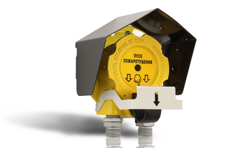

# Устройства управления
### Блок модульного пожаротушения БМП-R2

<table> 
  <thead> 
    <tr> 
      <th style="text-align: center">Параметр</th>
      <th style="text-align: center">Значение</th>
    </tr>
  </thead> 
  <tbody>
    <tr>
      <td style="text-align: left"><a href="/gk_manual/docs/docs/address_devices#краткое_название_устройства">Краткое название</a></td>
      <td style="text-align: center">Блок модульного пожаротушения</td>
    </tr>
    <tr>
      <td style="text-align: left"><a href="/gk_manual/docs/address_devices#обозначение_устройства">Обозначение</a></td>
      <td style="text-align: center">БМП</td>
    </tr>
    <tr>
      <td style="text-align: left"><a href="/gk_manual/docs/address_devices#краткое_обозначение_устройства">Краткое обозначение</a></td>
      <td style="text-align: center">БМП</td>
    </tr>
    <tr>
      <td style="text-align: left"><a href="/gk_manual/docs/address_devices#количество_адресов">Количество адресов</a></td>
      <td style="text-align: center">5</td>
    </tr>
    <tr>
      <td style="text-align: left"><a href="/gk_manual/docs/address_devices#устройство_противопожарной_защиты">УПЗ</a></td>
      <td style="text-align: center">Да</td>
    </tr>
    <tr>
      <td style="text-align: left"><a href="/gk_manual/docs/address_devices#режимы-работы-ау">Режимы работы</a></td>
      <td style="text-align: center"><a href="/gk_manual/docs/address_devices#режим_работы_ау_дежурный">ДЕЖУРНЫЙ</a>, <a href="/gk_manual/docs/address_devices#режим_работы_ау_автоматика_отключена">АВТОМАТИКА ОТКЛЮЧЕНА</a>, <a href="/gk_manual/docs/address_devices#режим_работы_ау_блокировка_пуска">БЛОКИРОВКА ПУСКА</a></td>
    </tr>
    <tr>
      <td style="text-align: left"><a href="/gk_manual/docs/address_devices#состояния-ау">Состояния</a></td>
      <td style="text-align: center"><a href="/gk_manual/docs/address_devices#состояние_ау_включено">включено</a>, <a href="/gk_manual/docs/address_devices#состояние_ау_включается">включается</a>, <a href="/gk_manual/docs/address_devices#состояние_ау_выключено">выключено</a>, <a href="/gk_manual/docs/address_devices#состояние_ау_неисправно">неисправно</a>
    </tr>    
  </tbody>
</table>

<a href="https://products.rubezh.ru/products/bmp_r2-3326/" target="_blank">На страницу продукта</a>

### Модуль автоматики дымоудаления МДУ-R2 исп. 24

|Наименование|Полное обозначение|Краткое обозначение|
|:---|:---:|:---:|
|Модуль автоматики дымоудаления|МДУ исп. 24|МДУ|

<a href="https://products.rubezh.ru/products/mdu_r2_isp_24-3362/" target="_blank">На страницу продукта</a>

### Модуль автоматики дымоудаления МДУ-R2 исп. 220

|Наименование|Полное обозначение|Краткое обозначение|
|:---|:---:|:---:|
|Модуль автоматики дымоудаления|МДУ исп. 220|МДУ|

<a href="https://products.rubezh.ru/products/mdu_r2_isp_220-3363/" target="_blank">На страницу продукта</a>

### Устройство дистанционного пуска электроконтактное адресное УДП 513-12

|Наименование|Полное обозначение|Краткое обозначение|
|:---|:---:|:---:|
|Устройство дистанционного пуска|УДП 513-12|УДП|

<a href="https://products.rubezh.ru/products/udp_513_12-3358/" target="_blank">На страницу продукта</a>

### Адресное устройство дистанционного пуска ИП 535-07еа-R2-ПУСК

|Наименование|Полное обозначение|Краткое обозначение|
|:---|:---:|:---:|
|Устройство дистанционного пуска взрывозащищенное|ИП 535-07еа-ПУСК|УДП|

<a href="https://products.rubezh.ru/products/ip535_07ea_r2_pusk-7110/" target="_blank">На страницу продукта</a>

### Устройство дистанционного пуска электроконтактное адресное со встроенным изолятором короткого замыкания УДП 513-12 ИКЗ

|Наименование|Полное обозначение|Краткое обозначение|
|:---|:---:|:---:|
|Устройство дистанционного пуска с изолятором|УДП 513-12 ИКЗ|УДП|

<a href="https://products.rubezh.ru/products/udp_513_12ikz-4315/" target="_blank">На страницу продукта</a>

### Шкаф управления насосом или вентилятором ШУН/В-R2

|Наименование|Полное обозначение|Краткое обозначение|
|:---|:---:|:---:|
|Шкаф управления вентилятором|ШУВ|ШУВ|
|Шкаф управления дренажным насосом|ШУН ДН|ШУН|
|Шкаф управления жокей насосом|ШУН ЖН|ШУН|
|Шкаф управления пожарным насосом|ШУН ПН|ШУН|

<a href="https://products.rubezh.ru/products/shun_v_r2-3355/" target="_blank">На страницу продукта</a>

### Шкаф управления задвижкой ШУЗ-R2

|Наименование|Полное обозначение|Краткое обозначение|
|:---|:---:|:---:|
|Шкаф управления задвижкой с дисковым затвором|ШУЗ КВ-МВ|ШУЗ|
|Шкаф управления задвижкой с шаровым затвором|ШУЗ КВ|ШУЗ|
|Шкаф управления задвижкой с шаровым затвором и датчиками уровня|ШУЗ КВ-ДУ|ШУЗ|

<a href="https://products.rubezh.ru/products/shuz_r2-3357/" target="_blank">На страницу продукта</a>
