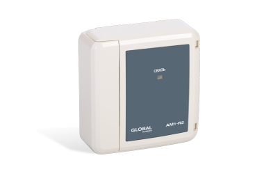

# Устройства ввода
### Барьер шлейфов сигнализации адресный АБШС-R2

<table> 
  <thead> 
    <tr> 
      <th style="text-align: center">Параметр</th>
      <th style="text-align: center">Значение</th>
    </tr>
  </thead> 
  <tbody>
    <tr>
      <td style="text-align: left"><a href="/gk_manual/docs/docs/address_devices#краткое_название_устройства">Краткое название</a></td>
      <td style="text-align: center">Барьер шлейфов сигнализации взрывозащищенный</td>
    </tr>
    <tr>
      <td style="text-align: left"><a href="/gk_manual/docs/address_devices#обозначение_устройства">Обозначение</a></td>
      <td style="text-align: center">АБШС</td>
    </tr>
    <tr>
      <td style="text-align: left"><a href="/gk_manual/docs/address_devices#краткое_обозначение_устройства">Краткое обозначение</a></td>
      <td style="text-align: center">АМП</td>
    </tr>
    <tr>
      <td style="text-align: left"><a href="/gk_manual/docs/address_devices#количество_адресов">Количество адресов</a></td>
      <td style="text-align: center">2</td>
    </tr>
    <tr>
      <td style="text-align: left"><a href="/gk_manual/docs/address_devices#устройство_противопожарной_защиты">УПЗ</a></td>
      <td style="text-align: center">Нет</td>
    </tr>
    <tr>
      <td style="text-align: left"><a href="/gk_manual/docs/address_devices#режимы-работы-ау">Режимы работы</a></td>
      <td style="text-align: center"><a href="/gk_manual/docs/address_devices#режим_работы_ау_дежурный">ДЕЖУРНЫЙ</a>, <a href="/gk_manual/docs/address_devices#режим_работы_ау_отключено">ОТКЛЮЧЕНО</a></td>
    </tr>
    <tr>
      <td style="text-align: left"><a href="/gk_manual/docs/address_devices#состояния-ау">Состояния</a></td>
      <td style="text-align: center"><a href="/gk_manual/docs/address_devices#состояние_ау_норма">норма</a>, <a href="/gk_manual/docs/address_devices#состояние_ау_сработка">сработка 1</a>, <a href="/gk_manual/docs/address_devices#состояние_ау_сработка">сработка 2</a>, <a href="/gk_manual/docs/address_devices#состояние_ау_неисправно">неисправно</a>, <a href="/gk_manual/docs/address_devices#состояние_ау_отключено">отключено</a></td>
    </tr>    
  </tbody>
</table>

|Наименование|Полное обозначение|Краткое обозначение|
|:---|:---:|:---:|
||АБШС|БШС|

<a href="https://products.rubezh.ru/products/abshs_r2-3329/" target="_blank">На страницу продукта</a>

### Метка адресная АМ1-R2

|Наименование|Полное обозначение|Краткое обозначение|
|:---|:---:|:---:|
|Метка адресная|АМ1|АМ|

<a href="https://products.rubezh.ru/products/am1_r2-3361/" target="_blank">На страницу продукта</a>

### Метка адресная АМ4-R2

|Наименование|Полное обозначение|Краткое обозначение|
|:---|:---:|:---:|
|Метка адресная|АМ4|АМ|

<a href="https://products.rubezh.ru/products/am4_r2-3378/" target="_blank">На страницу продукта</a>

### Метка адресная МАЭ-Т-R2 для извещателя пожарного теплового взрывозащищенного ИП 101-07

|Наименование|Полное обозначение|Краткое обозначение|
|:---|:---:|:---:|
|Метка адресная взрывозащищенная тепловая|МАЭ-Т|МАЭ|

<a href="https://products.rubezh.ru/products/mae_t_r2-3339/" target="_blank">На страницу продукта</a>

### Метка адресная пожарная АМП4-R2

|Наименование|Полное обозначение|Краткое обозначение|
|:---|:---:|:---:|
|Метка адресная пожарная|АМП4|АМП|

<a href="https://products.rubezh.ru/products/amp4_r2-3379/" target="_blank">На страницу продукта</a>
