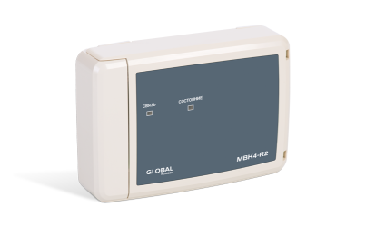

# Устройства вывода
### Барьер пусковой цепи адресный АБПЦ-R2

|Наименование|Полное обозначение|Краткое обозначение|
|:---|:---:|:---:|
|Барьер пусковой цепи взрывозащищенный|АБПЦ|БПЦ|

<a href="https://products.rubezh.ru/products/abpts_r2-3330/" target="_blank">На страницу продукта</a>

### Модуль выходов с контролем МВК2-R2

|Наименование|Полное обозначение|Краткое обозначение|
|:---|:---:|:---:|
|Модуль выходов с контролем|МВК2-R2|МВК|

<a href="https://products.rubezh.ru/products/mvk2_r2-3367/" target="_blank">На страницу продукта</a>

### Модуль выходов с контролем МВК4-R2

|Наименование|Полное обозначение|Краткое обозначение|
|:---|:---:|:---:|
|Модуль выходов с контролем|МВК4-R2|МВК|

<a href="https://products.rubezh.ru/products/mvk4_r2-3360/" target="_blank">На страницу продукта</a>

### Модуль выходов с контролем МВК8-R2

|Наименование|Полное обозначение|Краткое обозначение|
|:---|:---:|:---:|
|Модуль выходов с контролем|МВК8-R2|МВК|

<a href="https://products.rubezh.ru/products/mvk8_r2-3377/" target="_blank">На страницу продукта</a>

### Модуль релейный РМ1М-R2

|Наименование|Полное обозначение|Краткое обозначение|
|:---|:---:|:---:|
|Модуль релейный|РМ1М|РМ|

<a href="https://products.rubezh.ru/products/rm_r2-3376/" target="_blank">На страницу продукта</a>

### Модуль релейный РМ2-R2

|Наименование|Полное обозначение|Краткое обозначение|
|:---|:---:|:---:|
|Модуль релейный|РМ2|РМ|

<a href="https://products.rubezh.ru/products/rm_r2-3376/" target="_blank">На страницу продукта</a>

### Модуль релейный РМ4-R2

|Наименование|Полное обозначение|Краткое обозначение|
|:---|:---:|:---:|
|Модуль релейный|РМ4|РМ|

<a href="https://products.rubezh.ru/products/rm_r2-3376/" target="_blank">На страницу продукта</a>
