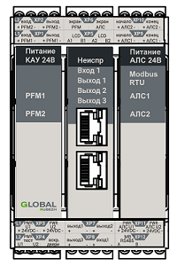
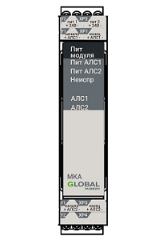
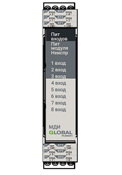

# Составные модули
Составные модули размещаются на DIN-рейке внутри корпуса <a href="/gk_manual/docs/gk#гк">ГК</a> и <a href="/gk_manual/docs/kau#кау">КАУ</a>. Связь между модулями осуществляется по [ВШС](#внутренняя-шина-связи).

## Модуль центрального процессора

МЦП обеспечивает основной функционал <a href="/gk_manual/docs/gk#гк">ГК</a> и <a href="/gk_manual/docs/kau#кау">КАУ</a> Для защиты от системной ошибки, приводящей к неисправности <a href="/gk_manual/docs/gk#гк">ГК</a> и <a href="/gk_manual/docs/kau#кау">КАУ</a>, вызванной полным или частичным отказом МЦП, предусмотрена возможность его резервирования путем добавления дополнительного модуля МЦП в состав <a href="/gk_manual/docs/gk#гк">ГК</a> и <a href="/gk_manual/docs/kau#кау">КАУ</a>

<a href="/gk_manual/docs/gk#гк">ГК</a> и <a href="/gk_manual/docs/kau#кау">КАУ</a> в своем составе имеют один или два МЦП.

## Модуль кольцевых адресных линий связи

МКА предназначен для увеличения количества подключаемых к <a href="/gk_manual/docs/gk#гк">ГК</a> и <a href="/gk_manual/docs/kau#кау">КАУ</a> <a href="/gk_manual/docs/intelligence/communications_lines#адресная-линия-связи">АЛС</a>, что позволяет увеличить количество подключенных <a href="/gk_manual/docs/global_system/address_devices#адресные-устройства">АУ</a>.

## Модуль дискретных входных сигналов с контролем цепи

МДИ предназначен для приема дискретных электрических сигналов. МДИ осуществляет автоматический контроль исправности [ВхЛС](#входная-дискретная-линия-связи) на обрыв и короткое замыкание.

## Модуль дискретных выходных сигналов с контролем цепи

МДО предназначен для передачи дискретных электрических сигналов. МДО осуществляет автоматический контроль исправности [ВыхЛС](#выходная-дискретная-линия-связи) на обрыв и короткое замыкание.
