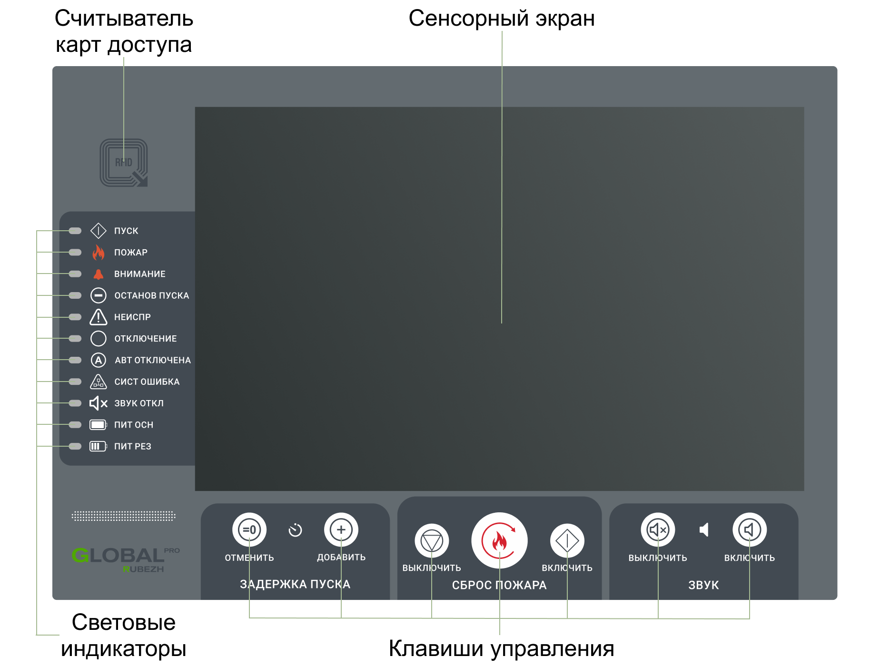

# Панель управления и индикации

## Считыватель карт доступа
Считыватель карт доступа является средством ограничения доступа посторонних лиц к прибору. Для работы с прибором сначала необходимо приложить карту доступа к считывателю.

## Световые индикаторы
Обобщенные световые индикаторы показывают текущее состояние ГК. Расшифровка направления отображается на сенсорном экране.

