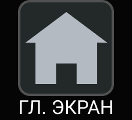
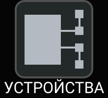
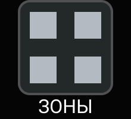
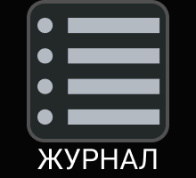
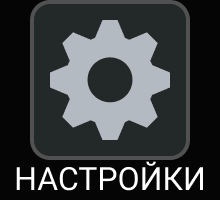
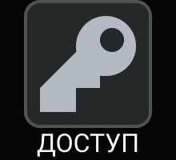

# Основное меню

  
  
  
  
  
  
  

Доступ к основному меню ограничен [профилями доступа пользователей](#профили-доступа-пользователей)). Переключение между экранами основного меню осуществляется посредством касания по соответствующей иконке.

