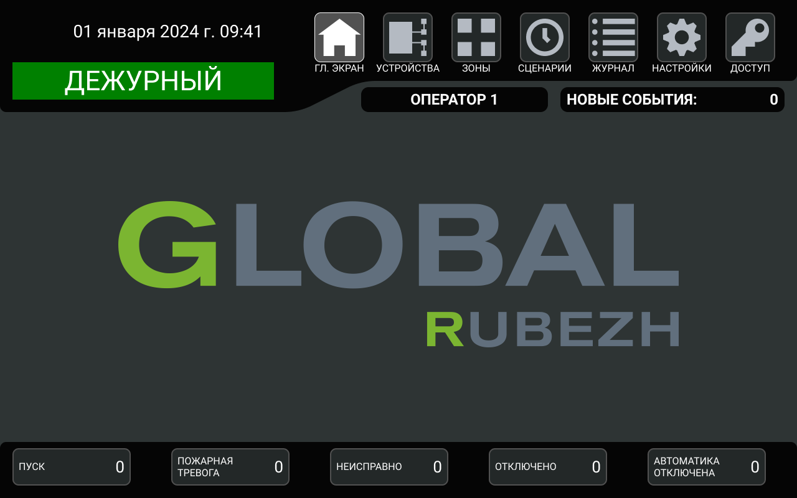

# Меню  ГЛ. ЭКРАН

Меню  ГЛ. ЭКРАН отображает наиболее приоритетный [экран событий](#экран-событий)). Если ГК находится в [состоянии ДЕЖУРНЫЙ](#состояние_дежурный)), то главный экран пуст.
ГК автоматически переходит в меню  ГЛ. ЭКРАН после 30 секунд бездействия пользователя при наличии хотя бы одного события [ПУСК](#экран-событий-пуск)), [ПОЖАРНАЯ ТРЕВОГА](#экран-событий-пожарная-тревога)) или [НЕИСПРАВНО](#экран-событий-неисправно)).
