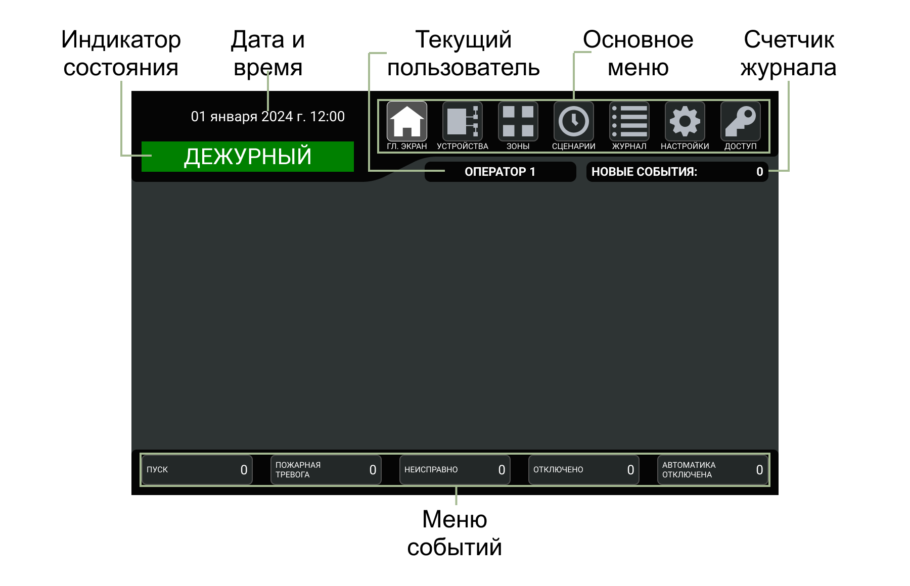

# Сенсорный экран
Сенсорный экран является средством вывода текстовой и символьной информации и основным органом управления ГК. Доступ к сенсорному экрану ограничен [профилями доступа пользователей](#профили-доступа-пользователей).

### Индикатор состояния
Индикатор состояния сенсорного экрана показывает текущее [состояние ГК](#основные-состояния-гк)). 

{: .note }
> Состояние отображается исходя из приоритета «Пуск» – «Пожар» – «Внимание» – «Неисправность». Состояние «Пуск» имеет наивысший приоритет отображения – при наличии хотя бы одного запущенного устройства противопожарной защиты, индикатор будет отображать состояние «Пуск» даже при наличии сигнала «Пожар», «Внимание», «Неисправность» и пр.

<table> 
  <thead> 
    <tr> 
      <th style="text-align: center">Индикатор</th>
      <th style="text-align: center">Режим работы</th>
    </tr>
  </thead> 
  <tbody>
    <tr>
      <td style="text-align: center"></td>
      <td style="text-align: left">Включается при переходе ГК в <a href="/gk_manual/docs/getting_started#состояние_пуск">состояние ПУСК</a></td>
    </tr>
    <tr>
      <td style="text-align: center"></td>
      <td style="text-align: left">Включается при переходе ГК в <a href="/gk_manual/docs/getting_started#состояние_пожар">состояние ПОЖАР</a></td>
    </tr>
    <tr>
      <td style="text-align: center"></td>
      <td style="text-align: left">Включается при переходе ГК в <a href="/gk_manual/docs/getting_started#состояние_внимание">состояние ВНИМАНИЕ</a></td>
    </tr>
  </tbody>
</table>
