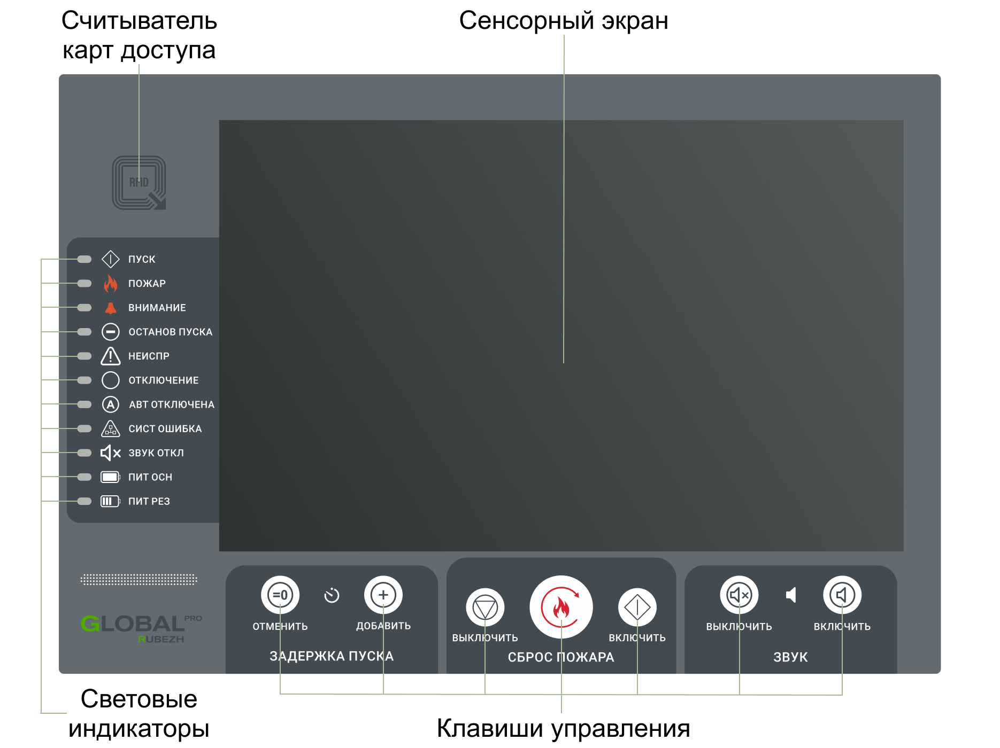

# Панель управления и индикации ГК

## Считыватель карт доступа
Считыватель карт доступа является [средством ограничения доступа посторонних лиц].

## Световые индикаторы
Световые индикаторы показывают текущие [состояния ГК]. Расшифровка по направлениям отображается на сенсорном экране.

<table> 
  <thead> 
    <tr> 
      <th style="text-align: center" colspan="2">Световой индикатор</th>
      <th style="text-align: center">Режим работы</th>
    </tr>
  </thead> 
  <tbody>
    <tr>
      <td id="световой_индикатор_гк_пуск" style="text-align: center"></td>
      <td style="text-align: left">ПУСК</td>
      <td style="text-align: left">Непрерывно светится красным при переходе в <a href="/gk_manual/docs/gk/gk_conditions#состояние_гк_пуск">состояние ПУСК</a></td>
    </tr>
    <tr>
      <td id="световой_индикатор_гк_пожар" style="text-align: center"></td>
      <td style="text-align: left">ПОЖАР</td>
      <td style="text-align: left">Непрерывно светится красным при переходе в <a href="/gk_manual/docs/gk/gk_conditions#состояние_гк_пожар">состояние ПОЖАР</a></td>
    </tr>
    <tr>
      <td id="световой_индикатор_гк_внимание" style="text-align: center"></td>
      <td style="text-align: left">ВНИМАНИЕ</td>
      <td style="text-align: left">Непрерывно светится красным при переходе в <a href="/gk_manual/docs/gk/gk_conditions#состояние_гк_внимание">состояние ВНИМАНИЕ</a></td>
    </tr>
    <tr>
      <td id="световой_индикатор_гк_останов_пуска" style="text-align: center"></td>
      <td style="text-align: left">ОСТАНОВ ПУСКА</td>
      <td style="text-align: left">Непрерывно светится желтым при ручной приостановке пуска одного или более сценария или <a href="/gk_manual/docs/address_devices#адресные-устройства">АУ</a> системы противопожарной защиты</td>
    </tr>
    <tr>
      <td id="световой_индикатор_гк_неисправ" style="text-align: center"></td>
      <td style="text-align: left">НЕИСПРАВ</td>
      <td style="text-align: left">Непрерывно светится желтым при переходе в <a href="/gk_manual/docs/gk/gk_conditions#состояние_гк_неисправность">состояние НЕИСПРАВНОСТЬ</a></td>
    </tr>
    <tr>
      <td id="световой_индикатор_гк_отключение" style="text-align: center"></td>
      <td style="text-align: left">ОТКЛЮЧЕНИЕ</td>
      <td style="text-align: left">Непрерывно светится желтым при переходе в <a href="/gk_manual/docs/gk/gk_conditions#состояние_гк_отключение">состояние ОТКЛЮЧЕНИЕ</a></td>
    </tr>
    <tr>
      <td id="световой_индикатор_гк_авт_отключена" style="text-align: center"></td>
      <td style="text-align: left">АВТ ОТКЛЮЧЕНА</td>
      <td style="text-align: left">Непрерывно светится желтым при переходе в <a href="/gk_manual/docs/gk/gk_conditions#состояние_гк_автоматика_отключена">состояние АВТОМАТИКА ОТКЛЮЧЕНА</a></td>
    </tr>
    <tr>
      <td id="световой_индикатор_гк_сист_ошибка" style="text-align: center"></td>
      <td style="text-align: left">СИСТ ОШИБКА</td>
      <td style="text-align: left">Непрерывно светится желтым при неисправности <a href="/gk_manual/docs/composite_modules#составные-модули">составных модулей</a> и/или при ошибке <a href="/gk_manual/docs/global_os#global-os">встроенной ОС</a></td>
    </tr>
    <tr>
      <td id="световой_индикатор_гк_звук_откл" style="text-align: center"></td>
      <td style="text-align: left">ЗВУК ОТКЛ</td>
      <td style="text-align: left">Непрерывно светится желтым при ручном отключении звуковой сигнализации</td>
    </tr>
    <tr>
      <td id="световой_индикатор_гк_пит_осн" style="text-align: center"></td>
      <td style="text-align: left">ПИТ ОСН</td>
      <td style="text-align: left">Непрерывно светится зеленым при наличии напряжения на основном входе электропитания. Мигает зеленым с частотой 1 Гц при напряжении питания на основном входе выше или ниже нормы</td> 
    </tr>
    <tr>
      <td id="световой_индикатор_гк_пит_рез" style="text-align: center"></td>
      <td style="text-align: left">ПИТ РЕЗ</td>
      <td style="text-align: left">Непрерывно светится зеленым при наличии напряжения на резервном входе электропитания. Мигает зеленым с частотой 1 Гц при напряжении питания на резервном входе выше или ниже нормы</td> 
    </tr>
  </tbody>
</table>

## Клавиши управления
Доступ к клавишам управления [ограничен]. Работа с клавишами осуществляется однократным нажатием. 

<table> 
  <thead> 
    <tr> 
      <th style="text-align: center" colspan="2">Клавиша управления</th>
      <th style="text-align: center">Режим работы</th>
    </tr>
  </thead> 
  <tbody>
    <tr>
      <td id="клавиша_гк_отменить" style="text-align: center"></td>
      <td style="text-align: left">ОТМЕНИТЬ</td>
      <td style="text-align: left">Немедленно включает (запускает) выбранный <a href="/gk_manual/docs/scenarios#сценарии">сценарий</a> или <a href="/gk_manual/docs/address_devices#адресные-устройства">АУ</a></td>
    </tr>
    <tr>
      <td id="клавиша_гк_добавить" style="text-align: center"></td>
      <td style="text-align: left">ДОБАВИТЬ</td>
      <td style="text-align: left">Увеличивает задержку включения выбранного <a href="/gk_manual/docs/scenarios#сценарии">сценария</a> или <a href="/gk_manual/docs/address_devices#адресные-устройства">АУ</a> на 10 секунд</td>
    </tr>
    <tr>
      <td id="клавиша_гк_выключить" style="text-align: center"></td>
      <td style="text-align: left">ВЫКЛЮЧИТЬ</td>
      <td style="text-align: left">Первое нажатие приостанавливает (ставит на паузу) отсчет задержки выбранного <a href="/gk_manual/docs/scenarios#сценарии">сценария</a> или <a href="/gk_manual/docs/address_devices#адресные-устройства">АУ</a>. Повторное нажатие выключает (останавливает) <a href="/gk_manual/docs/scenarios#сценарии">сценарий</a> или <a href="/gk_manual/docs/address_devices#адресные-устройства">АУ</a></td>
    </tr>
    <tr>
      <td id="клавиша_гк_сброс_пожара" style="text-align: center"></td>
      <td style="text-align: left">СБРОС ПОЖАРА</td>
      <td style="text-align: left">Переводит <a href="/gk_manual/docs/gk#гк">ГК</a> в <a href="/gk_manual/gk/gk_conditions#состояния-гк">состояние</a>, которое было до прихода сигнала «Пожар» или «Внимание». Если сигнал пожарной тревоги продолжает поступать, то <a href="/gk_manual/gk/gk_conditions#состояние_гк_пожар">состояние ПОЖАР</a> или <a href="/gk_manual/gk/gk_conditions#состояние_гк_внимание">состояние ВНИМАНИЕ</a> не сбрасывается</td>
    </tr>
    <tr>
      <td id="клавиша_гк_включить" style="text-align: center"></td>
      <td style="text-align: left">ВКЛЮЧИТЬ</td>
      <td style="text-align: left">Возобновляет (снимает с паузы) включение выбранного <a href="/gk_manual/docs/scenarios#сценарии">сценария</a> или <a href="/gk_manual/docs/address_devices#адресные-устройства">АУ</a></td>
    </tr>
    <tr>
      <td id="клавиша_гк_выключить_звук" style="text-align: center"></td>
      <td style="text-align: left">ВЫКЛЮЧИТЬ ЗВУК</td>
      <td style="text-align: left">Отключает звуковую сигнализацию <a href="/gk_manual/docs/gk#гк">ГК</a> до получения нового сообщения о неисправности, пожаре или пуске</td>
    </tr>
    <tr>
      <td id="клавиша_гк_включить_звук" style="text-align: center"></td>
      <td style="text-align: left">ВКЛЮЧИТЬ ЗВУК</td>
      <td style="text-align: left">Включает ранее отключенную звуковую сигнализацию</td>
    </tr>   
  </tbody>
</table>

{: .note }
> Клавиши  ОТМЕНИТЬ,  ДОБАВИТЬ,  ВЫКЛЮЧИТЬ и  ВКЛЮЧИТЬ являются контекстными – становятся активными только в меню событий ПУСК. Это обеспечивает быстрый и удобный доступ к функциям управления активными событиями пуска пожаротушения

[средством ограничения доступа посторонних лиц]: /gk_manual/docs/global_system/acms#ограничение-доступа
[ограничен]: /gk_manual/docs/global_system/acms#ограничение-доступа
[состояния ГК]: /gk_manual/docs/gk/gk_conditions#состояния-гк
