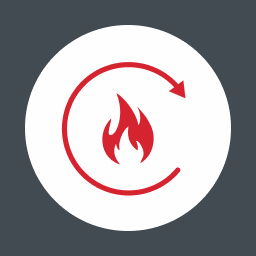

# Панель управления и индикации

## Считыватель карт доступа
Считыватель карт доступа является средством ограничения доступа посторонних лиц к прибору. Для работы с прибором сначала необходимо приложить карту доступа к считывателю.

## Световые индикаторы
Световые индикаторы показывают текущие состояния ГК. Расшифровка направления отображается на сенсорном экране.

<table> 
  <thead> 
    <tr> 
      <th style="text-align: center" colspan="2">Индикатор</th>
      <th style="text-align: center">Режим работы</th>
    </tr>
  </thead> 
  <tbody>
    <tr>
      <td style="text-align: center"></td>
      <td style="text-align: left">ПУСК</td>
      <td style="text-align: left">Непрерывно светится красным при переходе ГК в <a href="/gk_manual/docs/intelligence/conditions#состояние_пуск">состояние ПУСК</a></td>
    </tr>
    <tr>
      <td style="text-align: center"></td>
      <td style="text-align: left">ПОЖАР</td>
      <td style="text-align: left">Непрерывно светится красным при переходе ГК в <a href="/gk_manual/docs/intelligence/conditions#состояние_пожар">состояние ПОЖАР</a></td>
    </tr>
    <tr>
      <td style="text-align: center"></td>
      <td style="text-align: left">ВНИМАНИЕ</td>
      <td style="text-align: left">Непрерывно светится красным при переходе ГК в <a href="/gk_manual/docs/intelligence/conditions#состояние_внимание">состояние ВНИМАНИЕ</a></td>
    </tr>
    <tr>
      <td style="text-align: center"></td>
      <td style="text-align: left">ОСТАНОВ ПУСКА</td>
      <td style="text-align: left">Непрерывно светится желтым при ручной приостановке пуска одного или более сценария или устройства системы противопожарной защиты</td>
    </tr>
    <tr>
      <td style="text-align: center"></td>
      <td style="text-align: left">НЕИСПРАВ</td>
      <td style="text-align: left">Непрерывно светится желтым при переходе ГК в <a href="/gk_manual/docs/intelligence/conditions#состояние_неисправность">состояние НЕИСПРАВНОСТЬ</a></td>
    </tr>
    <tr>
      <td style="text-align: center"></td>
      <td style="text-align: left">ОТКЛЮЧЕНИЕ</td>
      <td style="text-align: left">Непрерывно светится желтым при переходе ГК в <a href="/gk_manual/docs/intelligence/conditions#состояние_отключение">состояние ОТКЛЮЧЕНИЕ</a></td>
    </tr>
    <tr>
      <td style="text-align: center"></td>
      <td style="text-align: left">АВТ ОТКЛЮЧЕНА</td>
      <td style="text-align: left">Непрерывно светится желтым при переходе ГК в <a href="/gk_manual/docs/intelligence/conditions#состояние_автоматика_отключена">состояние АВТОМАТИКА ОТКЛЮЧЕНА</a></td>
    </tr>
    <tr>
      <td style="text-align: center"></td>
      <td style="text-align: left">СИСТ ОШИБКА</td>
      <td style="text-align: left">Непрерывно светится желтым при неисправности составных модулей и/или при ошибке в программном обеспечении</td>
    </tr>
    <tr>
      <td style="text-align: center"></td>
      <td style="text-align: left">ЗВУК ОТКЛ</td>
      <td style="text-align: left">Непрерывно светится желтым при ручном отключении звуковой сигнализации</td>
    </tr>
    <tr>
      <td style="text-align: center"></td>
      <td style="text-align: left">ПИТ ОСН</td>
      <td style="text-align: left">Непрерывно светится зеленым при наличии напряжения на основном входе электропитания. Мигает зеленым с частотой 1 Гц при напряжении питания на основном входе выше или ниже нормы</td> 
    </tr>
    <tr>
      <td style="text-align: center"></td>
      <td style="text-align: left">ПИТ РЕЗ</td>
      <td style="text-align: left">Непрерывно светится зеленым при наличии напряжения на резервном входе электропитания. Мигает зеленым с частотой 1 Гц при напряжении питания на резервном входе выше или ниже нормы</td> 
    </tr>
  </tbody>
</table>

## Клавиши управления
Доступ к клавишам управления ограничен профилями доступа пользователей. Работа с клавишами осуществляется однократным нажатием. 

{: .note }
> Некоторые клавиши являются контекстными – функционируют только в [меню событий ПУСК](#меню-слюбытий-пуск)).

<table> 
  <thead> 
    <tr> 
      <th style="text-align: center" colspan="2">Клавиша</th>
      <th style="text-align: center">Режим работы</th>
    </tr>
  </thead> 
  <tbody>
    <tr>
      <td style="text-align: center"></td>
      <td style="text-align: left">ОТМЕНИТЬ (задержка пуска)</td>
      <td style="text-align: left"></td>
    </tr>
    <tr>
      <td style="text-align: center"></td>
      <td style="text-align: left">ДОБАВИТЬ (задержка пуска)</td>
      <td style="text-align: left"></td>
    </tr>
    <tr>
      <td style="text-align: center"></td>
      <td style="text-align: left">ВЫКЛЮЧИТЬ</td>
      <td style="text-align: left"></td>
    </tr>
    <tr>
      <td style="text-align: center"></td>
      <td style="text-align: left">СБРОС ПОЖАРА</td>
      <td style="text-align: left">Переводит ГК в состояние, которое было до прихода сигнала «Пожар» или «Внимание». Если сигнал продолжает поступать, то состояние «Пожар» или «Внимание» не сбрасывается</td>
    </tr>
    <tr>
      <td style="text-align: center"></td>
      <td style="text-align: left">ВКЛЮЧИТЬ</td>
      <td style="text-align: left"></td>
    </tr>
    <tr>
      <td style="text-align: center"></td>
      <td style="text-align: left">ВЫКЛЮЧИТЬ (звук)</td>
      <td style="text-align: left">Отключает звуковую сигнализацию до получения ГК нового сообщения о неисправности, пожаре или пуске</td>
    </tr>
    <tr>
      <td style="text-align: center"></td>
      <td style="text-align: left">ВКЛЮЧИТЬ (звук)</td>
      <td style="text-align: left">Включает отключенную звуковую сигнализацию</td>
    </tr>   
  </tbody>
</table>
