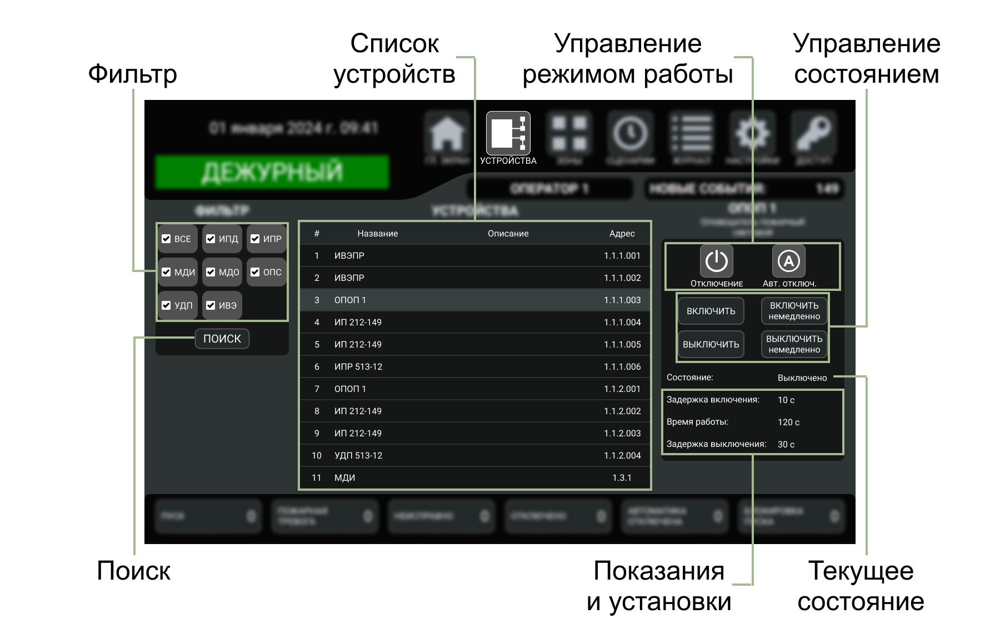

# Меню  УСТРОЙСТВА

В меню  УСТРОЙСТВА отображается информация о всех записанных в файл конфигурации устройствах.

Устройства отсортированы по <a href="/gk_manual/docs/global_system#адресный-номер">адресному номеру</a>, начиная с первого. При выборе определенного устройства в правой части экрана появляются кнопки управления режимом работы и состоянием, информация о текущем состоянии, показания и установки.

Фильтрация осуществляется по краткому обозначени. По умолчанию выводится список всех устройств (включен фильтр «ВСЕ»).

Кнопка «ПОИСК» позволяет найти определенное устройство по адресу или заводскому номеру.
