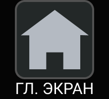

# Основное меню

  
  
  
  
  
  
  

Доступ к основному меню ограничен профилями доступа пользователей. Переключение между экранами основного меню осуществляется посредством касания по соответствующей иконке.

