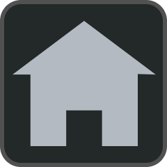
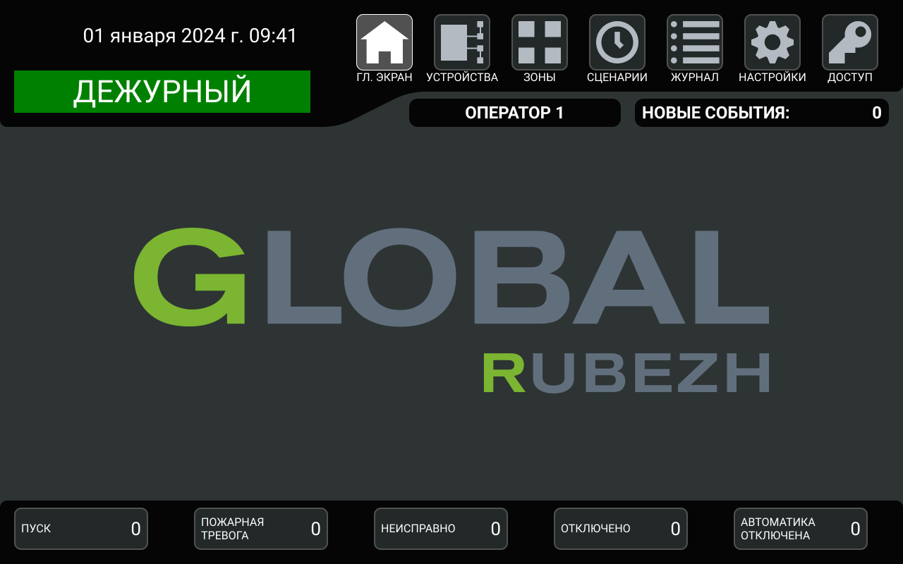

# Меню  ГЛ. ЭКРАН

Меню  ГЛ. ЭКРАН отображает наиболее приоритетный [экран событий](#экран-событий). Если <a href="/gk_manual/docs/gk#гк">ГК</a> находится в состоянии ДЕЖУРНЫЙ, то главный экран пуст.

<a href="/gk_manual/docs/gk#гк">ГК</a> автоматически переходит в меню  ГЛ. ЭКРАН после 30 секунд бездействия пользователя при наличии хотя бы одного события [ПУСК](#экран-событий-пуск), [ПОЖАРНАЯ ТРЕВОГА](#экран-событий-пожарная-тревога) или [НЕИСПРАВНО](#экран-событий-неисправно).
