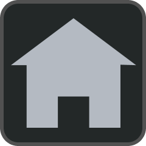
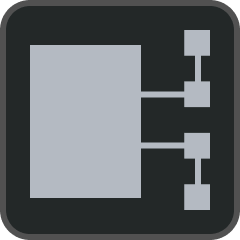
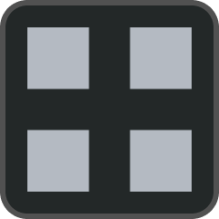

# Ограничение доступа
Ограничение доступа посторонних лиц к компонентам [системы] построено на базе радиочастотной идентификации (RFID), состоящей из считывателей и карт доступа (RFID-меток). Считыватели располагаются на [панели ГК] и [панели ТПУ]. Карты доступа выдаются ответственному персоналу.

Без авторизации работа в [системе] ограничена. Авторизованные пользователи делятся на группы по уровню доступа. [Система] автоматически распознает пользователя, приложившего карту доступа к считывателю, определяет его имя и уровень доступа. Выход пользователя (блокировка доступа) осуществляется автоматически спустя 5 минут бездействия пользователя или вручную нажатием соответствующей кнопки в меню <a href="/gk_manual/docs/global_os/main_menu/access"> ДОСТУП</a>.

<table> 
  <thead> 
    <tr> 
      <th style="text-align: center">Функция</th>
      <th style="text-align: center">Без авторизации</th>
      <th style="text-align: center">Оператор</th>
      <th style="text-align: center">Администратор</th>
    </tr>
  </thead> 
  <tbody>
    <tr>
      <td style="text-align: left">Просмотр основных состояний системы, <a href="/gk_manual/docs/gk/gk_conditions#состояния-гк">ГК</a> и <a href="/gk_manual/docs/kau/kau_conditions#состояния-кау">КАУ</a></td>
      <td style="text-align: center">+</td>
      <td style="text-align: center">+</td>
      <td style="text-align: center">+</td>
    </tr>
    <tr>
      <td style="text-align: left">Выключение звуковой сигнализации <a href="/gk_manual/docs/gk#гк">ГК</a> и <a href="/gk_manual/docs/tpu#тпу">ТПУ</a></td>
      <td style="text-align: center">-</td>
      <td style="text-align: center">+</td>
      <td style="text-align: center">+</td>
    </tr>
    <tr>
      <td style="text-align: left">Просмотр меню <a href="/gk_manual/docs/global_os/main_menu/main_screen"> ГЛ. ЭКРАН</a>, <a href="/gk_manual/docs/global_os/main_menu/devices"> УСТРОЙСТВА</a>, <a href="/gk_manual/docs/global_os/main_menu/zones"> ЗОНЫ</a>, <a href="/gk_manual/docs/global_os/main_menu/scenarios"> СЦЕНАРИИ</a> и <a href="/gk_manual/docs/global_os/main_menu/journal"> ЖУРНАЛ</a></td>
      <td style="text-align: center">-</td>
      <td style="text-align: center">+</td>
      <td style="text-align: center">+</td>
    </tr>
    <tr>
      <td style="text-align: left">Просмотр меню <a href="/gk_manual/docs/global_os/main_menu/settings"> НАСТРОЙКИ</a> и <a href="/gk_manual/docs/global_os/main_menu/access"> ДОСТУП</a></td>
      <td style="text-align: center">-</td>
      <td style="text-align: center">-</td>
      <td style="text-align: center">+</td>
    </tr>
    <tr>
      <td style="text-align: left">Доступ к <a href="/gk_manual/docs/gk/gk_control_panel#клавиши-управления">клавишам управления ГК</a> и клавишам управления ТПУ, в том числе сброс пожарной тревоги</td>
      <td style="text-align: center">-</td>
      <td style="text-align: center">+</td>
      <td style="text-align: center">+</td>
    </tr>
    <tr>
      <td style="text-align: left">Управление устройствами, сценариями и пожарными зонами</td>
      <td style="text-align: center">-</td>
      <td style="text-align: center">+</td>
      <td style="text-align: center">+</td>
    </tr>    
    <tr>
      <td style="text-align: left">Изменение настроек устройств, сценариев и пожарных зон</td>
      <td style="text-align: center">-</td>
      <td style="text-align: center">-</td>
      <td style="text-align: center">+</td>
    </tr>
   </tbody>
</table>

Добавление новых пользователей и запись соответствующих карт доступа в [систему] осуществляется в меню <a href="/gk_manual/docs/global_os/main_menu/access"> ДОСТУП</a>. Карты доступа, входящие в комплект поставки [ГК] и [ТПУ], записываются заводом-изготовителем.

[системы]: /gk_manual/docs/global_system#спз-глобал
[систему]: /gk_manual/docs/global_system#спз-глобал
[системе]: /gk_manual/docs/global_system#спз-глобал
[система]: /gk_manual/docs/global_system#спз-глобал
[панели ГК]: /gk_manual/docs/gk/gk_control_panel#панель-управления-и-индикации-гк
[панели ТПУ]: /gk_manual/docs/tpu/tpu_control_panel#панель-управления-и-индикации-тпу
[ГК]: /gk_manual/docs/gk#гк
[ТПУ]: /gk_manual/docs/tpu#тпу
