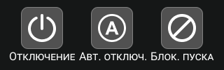
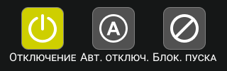

# Адресные устройства
## Системные параметры адресных устройств
<table> 
  <thead> 
    <tr> 
      <th style="text-align: center">Параметр</th>
      <th style="text-align: center">Описание</th>
    </tr>
  </thead> 
  <tbody>
    <tr>
      <td id="краткое_название_устройства" style="text-align: left">Краткое название</td>
      <td style="text-align: left">Наименование устройства в пользовательском интерфейсе ГК и <a href="/gk_manual/docs/global_system/tpu">ТПУ</a></td>
    </tr>
    <tr>
      <td id="обозначение_устройства" style="text-align: left">Обозначение</td>
      <td style="text-align: left">Полное обозначение устройства в пользовательском интерфейсе ГК и <a href="/gk_manual/docs/global_system/tpu">ТПУ</a></td>
    </tr>
    <tr>
      <td id="краткое_обозначение_устройства" style="text-align: left">Краткое обозначение</td>
      <td style="text-align: left">Краткое обозначение устройства. Используется для фильтра устройств в пользовательском интерфейсе ГК и <a href="/gk_manual/docs/global_system/tpu">ТПУ</a></td>
    </tr>
    <tr>
      <td id="количество_адресов" style="text-align: left">Количествово адресов</td>
      <td style="text-align: left">Количество <a href="/gk_manual/docs/global_system#адресный-номер-ау">адресных номеров</a>, которое устройство занимает в <a href="/gk_manual/docs/global_system">СПЗ</a></td>
    </tr>
    <tr>
      <td id="устройство_противопожарной_защиты" style="text-align: left">Устройство противопожарной защиты</td>
      <td style="text-align: left">Относится ли запуск (включение) устройства к активации систем противопожарной защиты по п. 7.1.4 ГОСТ Р 53325 (приводит ли запуск (включение) устройства к переходу ГК или <a href="/gk_manual/docs/global_system/kau">КАУ</a> в <a href="/gk_manual/docs/intelligence/conditions#состояние_пуск">состояние ПУСК</a>)</td>
    </tr>
  </tbody>
</table>

{: .note }
> 

Перечень систем противопожарной защиты по п. 7.1.4 ГОСТ Р 53325

  - система управления установками водяного и пенного пожаротушения;
  - система управления установками газового пожаротушения;
  - система управления установками порошкового пожаротушения;
  - система управления установками аэрозольного пожаротушения;
  - система управления средствами оповещения;
  - система управления установками дымо-газоудаления;
  - система формирования сигнала управления инженерным, технологическим оборудованием и иными устройствами, участвующими в обеспечении пожарной безопасности;
  - комбинированная система.

## Режим работы АУ

<table> 
  <thead> 
    <tr> 
      <th style="text-align: center">Положение переключателей</th>
      <th style="text-align: center">Режим работы</th>
      <th style="text-align: center">Описание</th>
    </tr>
  </thead> 
  <tbody>
    <tr>
      <td id="режим_работы_ау_дежурный" style="text-align: center"></td>
      <td style="text-align: center">ДЕЖУРНЫЙ</td>
      <td style="text-align: left">Устройство готово к работе (нормальный режим работы, устанавливается по-умолчанию)</td>
    </tr>
    <tr>
      <td id="режим_работы_ау_отключено" style="text-align: center"></td>
      <td style="text-align: center">ОТКЛЮЧЕНО</td>
      <td style="text-align: left">ГК игнорирует информацию о текущем состоянии устройства, но продолжает контролировать физическое наличие устройства в <a href="/gk_manual/docs/intelligence/communications_lines#адресная-линия-связи">АЛС</a></td>
    </tr>
    <tr>
      <td id="режим_работы_ау_автоматика_отключена" style="text-align: center"></td>
      <td style="text-align: center">АВТОМАТИКА ОТКЛЮЧЕНА</td>
      <td style="text-align: left">Устройство игнорирует автоматические команды сценариев, доступно лишь ручное (непосредственно пользователем) управление устройством с помощью клавиш и кнопок управления состоянием</td>
    </tr>
    <tr>
      <td id="режим_работы_ау_блокировка_пуска" style="text-align: center"></td>
      <td style="text-align: center">БЛОКИРОВКА ПУСКА</td>
      <td style="text-align: left">Устройство игнорирует автоматические команды сценариев и ручные команды пользователя (за исключением команд на изменение режима работы)</td>
    </tr>
  </tbody>
</table>

Для всех АУ может быть установлен только один режим работы. Для некоторых АУ режимы работы АВТОМАТИКА ОТКЛЮЧЕНА и БЛОКИРОВКА ПУСКА недоступны.

Для <a href="/gk_manual/docs/global_system#многоадресные-ау">многоадресных устройств</a> режим работы устанавливается для каждого адреса отдельно.

Информация об изменение режима работы отображается в журнале.

Независимо от установленного режима работы, информационный обмен между АУ и ГК не прекращается, ГК продолжает контролировать физическое наличие АУ в <a href="/gk_manual/docs/intelligence/communications_lines#адресная-линия-связи">АЛС</a>.

## Состояние АУ
В зависимости от установленного режима работы, АУ могут находиться в различных состояниях.

<table> 
  <thead> 
    <tr> 
      <th style="text-align: center">Режим работы</th>
      <th style="text-align: center">Состояние</th>
      <th style="text-align: center">Описание</th>
    </tr>
  </thead> 
  <tbody>
    <tr>
      <td rowspan="7" style="text-align: center">ДЕЖУРНЫЙ</td>
      <td id="состояние_ау_норма" style="text-align: center">Норма</td>
      <td style="text-align: left">Нормальное рабочее состояние <a href="/gk_manual/docs/global_system/address_devices#извещатели">извещателей</a>, характеризующее отсутствие факторов пожарной тревоги</td>
    </tr> 
    <tr>
      <td id="состояние_ау_сработка" style="text-align: center">Сработка</td>
      <td style="text-align: left">Состояние <a href="/gk_manual/docs/global_system/address_devices#извещатели">извещателей</a>, при котором они формируют сигнал о пожарной тревоге</td>
    </tr>
    <tr>
      <td id="состояние_ау_включено" style="text-align: center">Включено</td>
      <td style="text-align: left"></td>
    </tr>
    <tr>
      <td id="состояние_ау_включается" style="text-align: center">Включается</td>
      <td style="text-align: left"></td>
    </tr>
    <tr>
      <td id="состояние_ау_выключено" style="text-align: center">Выключено</td>
      <td style="text-align: left"></td>
    </tr>
    <tr>
      <td id="состояние_ау_выключается" style="text-align: center">Выключается</td>
      <td style="text-align: left"></td>
    </tr>
    <tr>
      <td id="состояние_ау_неисправно" style="text-align: center">Неисправно</td>
      <td style="text-align: left"></td>
    </tr>
    <tr>
      <td rowspan="2" style="text-align: center">ОТКЛЮЧЕНО</td>
      <td id="состояние_ау_отключено" style="text-align: center">Отключено</td>
      <td style="text-align: left"></td>
    </tr>
    <tr>
      <td id="состояние_ау_неисправно2" style="text-align: center">Неисправно</td>
      <td style="text-align: left"></td>
    </tr>
    <tr>
      <td rowspan="5" style="text-align: center">АВТОМАТИКА ОТКЛЮЧЕНА</td>
      <td id="состояние_ау_включено2" style="text-align: center">Включено</td>
      <td style="text-align: left"></td>
    </tr>
    <tr>
      <td id="состояние_ау_включается2" style="text-align: center">Включается</td>
      <td style="text-align: left"></td>
    </tr>
    <tr>
      <td id="состояние_ау_выключено2" style="text-align: center">Выключено</td>
      <td style="text-align: left"></td>
    </tr>
    <tr>
      <td id="состояние_ау_выключается2" style="text-align: center">Выключается</td>
      <td style="text-align: left"></td>
    </tr>
    <tr>
      <td id="состояние_ау_неисправно3" style="text-align: center">Неисправно</td>
      <td style="text-align: left"></td>
    </tr>
    <tr>
      <td rowspan="2" style="text-align: center">БЛОКИРОВКА ПУСКА</td>
      <td id="состояние_ау_выключено3" style="text-align: center">Выключено</td>
      <td style="text-align: left"></td>
    </tr>
    <tr>
      <td id="состояние_ау_неисправно4" style="text-align: center">Неисправно</td>
      <td style="text-align: left"></td>
    </tr>
  </tbody>
</table>
