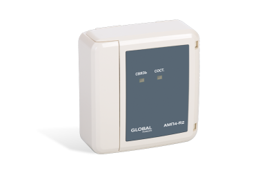
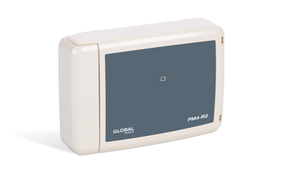
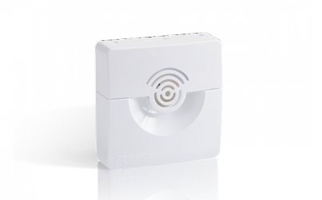

# Список совместимых адресных устройств
{: .no_toc }
1. TOC
{:toc}
## Извещатели
##### Извещатель пожарный дымовой оптико-электронный адресно-аналоговый ИП 212-149
{: .no_toc }

|Наименование|Полное обозначение|Краткое обозначение|
|:---|:---:|:---:|
|Извещатель пожарный дымовой|ИП 212-149|ИПД|

<a href="https://products.rubezh.ru/products/ip_212_149_w1_04-3299/" target="_blank">На страницу продукта</a>

##### Извещатель пожарный комбинированный дымовой оптико-электронный тепловой максимально-дифференциальный адресно-аналоговый ИП 212/101-11-PR
{: .no_toc }

|Наименование|Полное обозначение|Краткое обозначение|
|:---|:---:|:---:|
|Извещатель пожарный комбинированный|ИП 212/101-11-PR|ИПК|

<a href="https://products.rubezh.ru/products/ip_212_101_11_pr_w1_04-3300/" target="_blank">На страницу продукта</a>

##### Извещатель пожарный пламени адресный ИП 329 ИОЛИТ-Exd-R
{: .no_toc }

|Наименование|Полное обозначение|Краткое обозначение|
|:---|:---:|:---:|
|Извещатель пожарный пламени взрывозащищенный|ИП 329 ИОЛИТ-Exd-R|ИПП|

<a href="https://products.rubezh.ru/products/ip_329_iolit_exd_r2-3327/" target="_blank">На страницу продукта</a>

##### Извещатель пожарный ручной взрывозащищенный адресный ИП 535-07еа-R2
{: .no_toc }

|Наименование|Полное обозначение|Краткое обозначение|
|:---|:---:|:---:|
|Извещатель пожарный ручной взрывозащищенный|ИП 535-07еа|ИПР|

<a href="https://products.rubezh.ru/products/ip535_07ea_r2_pusk_1-7109/" target="_blank">На страницу продукта</a>

##### Извещатель пожарный ручной электроконтактный адресный ИПР 513-12
{: .no_toc }

|Наименование|Полное обозначение|Краткое обозначение|
|:---|:---:|:---:|
|Извещатель пожарный ручной|ИПР 513-12|ИПР|

<a href="https://products.rubezh.ru/products/ipr_513_12-3369/" target="_blank">На страницу продукта</a>

##### Извещатель пожарный ручной электроконтактный адресный со встроенным изолятором короткого замыкания ИПР 513-12 ИКЗ
{: .no_toc }

|Наименование|Полное обозначение|Краткое обозначение|
|:---|:---:|:---:|
|Извещатель пожарный ручной с изолятором|ИПР 513-12 ИКЗ|ИПР|

<a href="https://products.rubezh.ru/products/ipr_513_12ikz-4314/" target="_blank">На страницу продукта</a>

##### Извещатель пожарный тепловой взрывозащищенный адресный ИП 101-07a-P
{: .no_toc }

|Наименование|Полное обозначение|Краткое обозначение|
|:---|:---:|:---:|
|Извещатель пожарный тепловой взрывозащищенный|ИП 101-07a-P|ИПТ|

Скоро в продаже

##### Извещатель пожарный тепловой максимально-дифференциальный адресно-аналоговый ИП 101-52-PR
{: .no_toc }

|Наименование|Полное обозначение|Краткое обозначение|
|:---|:---:|:---:|
|Извещатель пожарный тепловой|ИП 101-52-PR|ИПТ|

<a href="https://products.rubezh.ru/products/ip_101_52_pr_w1_04-3301/" target="_blank">На страницу продукта</a>

## Устройства ввода-вывода
##### Барьер пусковой цепи адресный АБПЦ-R2
{: .no_toc }

|Наименование|Полное обозначение|Краткое обозначение|
|:---|:---:|:---:|
|Барьер пусковой цепи взрывозащищенный|АБПЦ|БПЦ|

<a href="https://products.rubezh.ru/products/abpts_r2-3330/" target="_blank">На страницу продукта</a>

##### Барьер шлейфов сигнализации адресный АБШС-R2
{: .no_toc }

|Наименование|Полное обозначение|Краткое обозначение|
|:---|:---:|:---:|
|Барьер шлейфов сигнализации взрывозащищенный|АБШС|БШС|

<a href="https://products.rubezh.ru/products/abshs_r2-3329/" target="_blank">На страницу продукта</a>

##### Метка адресная АМ1-R2
{: .no_toc }

|Наименование|Полное обозначение|Краткое обозначение|
|:---|:---:|:---:|
|Метка адресная|АМ1|АМ|

<a href="https://products.rubezh.ru/products/am1_r2-3361/" target="_blank">На страницу продукта</a>

##### Метка адресная АМ4-R2
{: .no_toc }

|Наименование|Полное обозначение|Краткое обозначение|
|:---|:---:|:---:|
|Метка адресная|АМ4|АМ|

<a href="https://products.rubezh.ru/products/am4_r2-3378/" target="_blank">На страницу продукта</a>

##### Метка адресная МАЭ-Т-R2 для извещателя пожарного теплового взрывозащищенного ИП 101-07
{: .no_toc }

|Наименование|Полное обозначение|Краткое обозначение|
|:---|:---:|:---:|
|Метка адресная взрывозащищенная тепловая|МАЭ-Т|МАЭ|

<a href="https://products.rubezh.ru/products/mae_t_r2-3339/" target="_blank">На страницу продукта</a>

##### Метка адресная пожарная АМП4-R2
{: .no_toc }

|Наименование|Полное обозначение|Краткое обозначение|
|:---|:---:|:---:|
|Метка адресная пожарная|АМП4|АМП|

<a href="https://products.rubezh.ru/products/amp4_r2-3379/" target="_blank">На страницу продукта</a>

##### Модуль выходов с контролем МВК2-R2
{: .no_toc }

|Наименование|Полное обозначение|Краткое обозначение|
|:---|:---:|:---:|
|Модуль выходов с контролем|МВК2-R2|МВК|

<a href="https://products.rubezh.ru/products/mvk2_r2-3367/" target="_blank">На страницу продукта</a>

##### Модуль выходов с контролем МВК4-R2
{: .no_toc }

|Наименование|Полное обозначение|Краткое обозначение|
|:---|:---:|:---:|
|Модуль выходов с контролем|МВК4-R2|МВК|

<a href="https://products.rubezh.ru/products/mvk4_r2-3360/" target="_blank">На страницу продукта</a>

##### Модуль выходов с контролем МВК8-R2
{: .no_toc }

|Наименование|Полное обозначение|Краткое обозначение|
|:---|:---:|:---:|
|Модуль выходов с контролем|МВК8-R2|МВК|

<a href="https://products.rubezh.ru/products/mvk8_r2-3377/" target="_blank">На страницу продукта</a>

##### Модуль релейный РМ1М-R2
{: .no_toc }

|Наименование|Полное обозначение|Краткое обозначение|
|:---|:---:|:---:|
|Модуль релейный|РМ1М|РМ|

<a href="https://products.rubezh.ru/products/rm_r2-3376/" target="_blank">На страницу продукта</a>

##### Модуль релейный РМ2-R2
{: .no_toc }

|Наименование|Полное обозначение|Краткое обозначение|
|:---|:---:|:---:|
|Модуль релейный|РМ2|РМ|

<a href="https://products.rubezh.ru/products/rm_r2-3376/" target="_blank">На страницу продукта</a>

##### Модуль релейный РМ4-R2
{: .no_toc }

|Наименование|Полное обозначение|Краткое обозначение|
|:---|:---:|:---:|
|Модуль релейный|РМ4|РМ|

<a href="https://products.rubezh.ru/products/rm_r2-3376/" target="_blank">На страницу продукта</a>

## Оповещатели
##### Оповещатель взрывозащищенный адресный СКОПА-R
{: .no_toc }

|Наименование|Полное обозначение|Краткое обозначение|
|:---|:---:|:---:|
|Оповещатель пожарный комбинированный взрывозащищенный|СКОПА-R|ОПК|

<a href="https://products.rubezh.ru/products/skopa_r2-3309/" target="_blank">На страницу продукта</a>

##### Оповещатель охранно-пожарный звуковой адресный ОПОП 2-R2
{: .no_toc }

|Наименование|Полное обозначение|Краткое обозначение|
|:---|:---:|:---:|
|Оповещатель пожарный звуковой|ОПОП 2|ОПЗ|

<a href="https://products.rubezh.ru/products/opop_2_r2-3380/" target="_blank">На страницу продукта</a>

##### Оповещатель охранно-пожарный комбинированный свето-звуковой адресный ОПОП 124-R2
{: .no_toc }

|Наименование|Полное обозначение|Краткое обозначение|
|:---|:---:|:---:|
|Оповещатель пожарный комбинированный|ОПОП 124|ОПК|

<a href="https://products.rubezh.ru/products/opop_124_r2-3370/" target="_blank">На страницу продукта</a>

##### Оповещатель охранно-пожарный световой адресный ОПОП 1-R2
{: .no_toc }

|Наименование|Полное обозначение|Краткое обозначение|
|:---|:---:|:---:|
|Оповещатель пожарный световой|ОПОП 1|ОПС|

<a href="https://products.rubezh.ru/products/opop_1_r2-3371/" target="_blank">На страницу продукта</a>

##### Оповещатель светозвуковой взрывозащищенный пожарный адресный ЗОВ-R
{: .no_toc }

|Наименование|Полное обозначение|Краткое обозначение|
|:---|:---:|:---:|
|Оповещатель пожарный комбинированный взрывозащищенный|ЗОВ-R|ОПК|

<a href="https://products.rubezh.ru/products/zov_r2-3328/" target="_blank">На страницу продукта</a>

## Устройства управления
##### Блок модульного пожаротушения БМП-R2
{: .no_toc }

|Наименование|Полное обозначение|Краткое обозначение|
|:---|:---:|:---:|
|Блок модульного пожаротушения|БМП|БМП|

<a href="https://products.rubezh.ru/products/bmp_r2-3326/" target="_blank">На страницу продукта</a>

##### Модуль автоматики дымоудаления МДУ-R2 исп. 24
{: .no_toc }

|Наименование|Полное обозначение|Краткое обозначение|
|:---|:---:|:---:|
|Модуль автоматики дымоудаления|МДУ исп. 24|МДУ|

<a href="https://products.rubezh.ru/products/mdu_r2_isp_24-3362/" target="_blank">На страницу продукта</a>

##### Модуль автоматики дымоудаления МДУ-R2 исп. 220
{: .no_toc }

|Наименование|Полное обозначение|Краткое обозначение|
|:---|:---:|:---:|
|Модуль автоматики дымоудаления|МДУ исп. 220|МДУ|

<a href="https://products.rubezh.ru/products/mdu_r2_isp_220-3363/" target="_blank">На страницу продукта</a>

##### Устройство дистанционного пуска электроконтактное адресное УДП 513-12
{: .no_toc }

|Наименование|Полное обозначение|Краткое обозначение|
|:---|:---:|:---:|
|Устройство дистанционного пуска|УДП 513-12|УДП|

<a href="https://products.rubezh.ru/products/udp_513_12-3358/" target="_blank">На страницу продукта</a>

##### Адресное устройство дистанционного пуска ИП 535-07еа-R2-ПУСК
{: .no_toc }

|Наименование|Полное обозначение|Краткое обозначение|
|:---|:---:|:---:|
|Устройство дистанционного пуска взрывозащищенное|ИП 535-07еа-ПУСК|УДП|

<a href="https://products.rubezh.ru/products/ip535_07ea_r2_pusk-7110/" target="_blank">На страницу продукта</a>

##### Устройство дистанционного пуска электроконтактное адресное со встроенным изолятором короткого замыкания УДП 513-12 ИКЗ
{: .no_toc }

|Наименование|Полное обозначение|Краткое обозначение|
|:---|:---:|:---:|
|Устройство дистанционного пуска с изолятором|УДП 513-12 ИКЗ|УДП|

<a href="https://products.rubezh.ru/products/udp_513_12ikz-4315/" target="_blank">На страницу продукта</a>

##### Шкаф управления насосом или вентилятором ШУН/В-R2
{: .no_toc }

|Наименование|Полное обозначение|Краткое обозначение|
|:---|:---:|:---:|
|Шкаф управления вентилятором|ШУВ|ШУВ|
|Шкаф управления дренажным насосом|ШУН ДН|ШУН|
|Шкаф управления жокей насосом|ШУН ЖН|ШУН|
|Шкаф управления пожарным насосом|ШУН ПН|ШУН|

<a href="https://products.rubezh.ru/products/shun_v_r2-3355/" target="_blank">На страницу продукта</a>

##### Шкаф управления задвижкой ШУЗ-R2
{: .no_toc }

|Наименование|Полное обозначение|Краткое обозначение|
|:---|:---:|:---:|
|Шкаф управления задвижкой с дисковым затвором|ШУЗ КВ-МВ|ШУЗ|
|Шкаф управления задвижкой с шаровым затвором|ШУЗ КВ|ШУЗ|
|Шкаф управления задвижкой с шаровым затвором и датчиками уровня|ШУЗ КВ-ДУ|ШУЗ|

<a href="https://products.rubezh.ru/products/shuz_r2-3357/" target="_blank">На страницу продукта</a>

## Источники питания
##### Источник вторичного электропитания резервированный адресный ИВЭПР 12/2 RS-R2
{: .no_toc }

|Наименование|Полное обозначение|Краткое обозначение|
|:---|:---:|:---:|
|Источник вторичного электропитания|ИВЭПР|ИВЭ|

<a href="https://products.rubezh.ru/products/ivepr_12_2_rs_r2-3341/" target="_blank">На страницу продукта</a>

##### Источник вторичного электропитания резервированный адресный ИВЭПР 12/3,5 RS-R2
{: .no_toc }

|Наименование|Полное обозначение|Краткое обозначение|
|:---|:---:|:---:|
|Источник вторичного электропитания|ИВЭПР|ИВЭ|

<a href="https://products.rubezh.ru/products/ivepr_12_3_5_rs_r2-3318/" target="_blank">На страницу продукта</a>

##### Источник вторичного электропитания резервированный адресный ИВЭПР 12/5 RS-R2
{: .no_toc }

|Наименование|Полное обозначение|Краткое обозначение|
|:---|:---:|:---:|
|Источник вторичного электропитания|ИВЭПР|ИВЭ|

<a href="https://products.rubezh.ru/products/ivepr_12_5_rs_r2-3319/" target="_blank">На страницу продукта</a>

##### Источник вторичного электропитания резервированный адресный ИВЭПР 24/2,5 RS-R2
{: .no_toc }

|Наименование|Полное обозначение|Краткое обозначение|
|:---|:---:|:---:|
|Источник вторичного электропитания|ИВЭПР|ИВЭ|

<a href="https://products.rubezh.ru/products/ivepr_24_2_5_rs_r2-3342/" target="_blank">На страницу продукта</a>

## Вспомогательные устройства
##### Изолятор короткого замыкания МИ-R2
{: .no_toc }

|Наименование|Полное обозначение|Краткое обозначение|
|:---|:---:|:---:|
|Изолятор короткого замыкания|МИ|МИ|

<a href="https://products.rubezh.ru/products/mi_r2_1-7076/" target="_blank">На страницу продукта</a>

##### Изолятор короткого замыкания базовый МИБ-R2
{: .no_toc }

|Наименование|Полное обозначение|Краткое обозначение|
|:---|:---:|:---:|
|Изолятор короткого замыкания базовый|МИБ|МИ|

<a href="https://products.rubezh.ru/products/mib_r2_1-7539/" target="_blank">На страницу продукта</a>

##### Индикатор состояний ИС-R2
{: .no_toc }

|Наименование|Полное обозначение|Краткое обозначение|
|:---|:---:|:---:|
|Индикатор состояний|ИС|ИС|

<a href="https://products.rubezh.ru/products/is_r2-3331/" target="_blank">На страницу продукта</a>

##### Модуль ветвления и подпитки МВП-R2
{: .no_toc }

|Наименование|Полное обозначение|Краткое обозначение|
|:---|:---:|:---:|
|Модуль ветвления и подпитки|МВП|ИМВПС|

<a href="https://products.rubezh.ru/products/mvp_r2-3372/" target="_blank">На страницу продукта</a>

##### Модуль связи ведущий МСВ-R2
{: .no_toc }

|Наименование|Полное обозначение|Краткое обозначение|
|:---|:---:|:---:|
|Модуль связи ведущий|МСВ|МСВ|

<a href="https://products.rubezh.ru/products/msv_r2-3315/" target="_blank">На страницу продукта</a>

##### Модуль связи подчиненный МСП-R2
{: .no_toc }

|Наименование|Полное обозначение|Краткое обозначение|
|:---|:---:|:---:|
|Модуль связи подчиненный|МСП|МСП|

<a href="https://products.rubezh.ru/products/msp_r2-3314/" target="_blank">На страницу продукта</a>

## Взрывозащищенные устройства
##### Барьер пусковой цепи адресный АБПЦ-R2
{: .no_toc }

|Наименование|Полное обозначение|Краткое обозначение|
|:---|:---:|:---:|
|Барьер пусковой цепи взрывозащищенный|АБПЦ|БПЦ|

<a href="https://products.rubezh.ru/products/abpts_r2-3330/" target="_blank">На страницу продукта</a>

##### Барьер шлейфов сигнализации адресный АБШС-R2
{: .no_toc }

|Наименование|Полное обозначение|Краткое обозначение|
|:---|:---:|:---:|
|Барьер шлейфов сигнализации взрывозащищенный|АБШС|БШС|

<a href="https://products.rubezh.ru/products/abshs_r2-3329/" target="_blank">На страницу продукта</a>

##### Извещатель пожарный пламени адресный ИП 329 ИОЛИТ-Exd-R
{: .no_toc }

|Наименование|Полное обозначение|Краткое обозначение|
|:---|:---:|:---:|
|Извещатель пожарный пламени взрывозащищенный|ИП 329 ИОЛИТ-Exd-R|ИПП|

<a href="https://products.rubezh.ru/products/ip_329_iolit_exd_r2-3327/" target="_blank">На страницу продукта</a>

##### Извещатель пожарный ручной взрывозащищенный адресный ИП 535-07еа-R2
{: .no_toc }

|Наименование|Полное обозначение|Краткое обозначение|
|:---|:---:|:---:|
|Извещатель пожарный ручной взрывозащищенный|ИП 535-07еа|ИПР|

<a href="https://products.rubezh.ru/products/ip535_07ea_r2_pusk_1-7109/" target="_blank">На страницу продукта</a>

##### Извещатель пожарный тепловой взрывозащищенный адресный ИП 101-07a-P
{: .no_toc }

|Наименование|Полное обозначение|Краткое обозначение|
|:---|:---:|:---:|
|Извещатель пожарный тепловой взрывозащищенный|ИП 101-07a-P|ИПТ|

Скоро в продаже

##### Метка адресная МАЭ-Т-R2 для извещателя пожарного теплового взрывозащищенного ИП 101-07
{: .no_toc }

|Наименование|Полное обозначение|Краткое обозначение|
|:---|:---:|:---:|
|Метка адресная взрывозащищенная тепловая|МАЭ-Т|МАЭ|

<a href="https://products.rubezh.ru/products/mae_t_r2-3339/" target="_blank">На страницу продукта</a>

##### Оповещатель взрывозащищенный адресный СКОПА-R
{: .no_toc }

|Наименование|Полное обозначение|Краткое обозначение|
|:---|:---:|:---:|
|Оповещатель пожарный комбинированный взрывозащищенный|СКОПА-R|ОПК|

<a href="https://products.rubezh.ru/products/skopa_r2-3309/" target="_blank">На страницу продукта</a>

##### Оповещатель светозвуковой взрывозащищенный пожарный адресный ЗОВ-R
{: .no_toc }

|Наименование|Полное обозначение|Краткое обозначение|
|:---|:---:|:---:|
|Оповещатель пожарный комбинированный взрывозащищенный|ЗОВ-R|ОПК|

<a href="https://products.rubezh.ru/products/zov_r2-3328/" target="_blank">На страницу продукта</a>

##### Адресное устройство дистанционного пуска ИП 535-07еа-R2-ПУСК
{: .no_toc }

|Наименование|Полное обозначение|Краткое обозначение|
|:---|:---:|:---:|
|Устройство дистанционного пуска взрывозащищенное|ИП 535-07еа-ПУСК|УДП|

<a href="https://products.rubezh.ru/products/ip535_07ea_r2_pusk-7110/" target="_blank">На страницу продукта</a>

## Устройства с изолятором короткого замыкания
##### Изолятор короткого замыкания МИ-R2
{: .no_toc }

|Наименование|Полное обозначение|Краткое обозначение|
|:---|:---:|:---:|
|Изолятор короткого замыкания|МИ|МИ|

<a href="https://products.rubezh.ru/products/mi_r2_1-7076/" target="_blank">На страницу продукта</a>

##### Извещатель пожарный ручной электроконтактный адресный со встроенным изолятором короткого замыкания ИПР 513-12 ИКЗ
{: .no_toc }

|Наименование|Полное обозначение|Краткое обозначение|
|:---|:---:|:---:|
|Извещатель пожарный ручной с изолятором|ИПР 513-12 ИКЗ|ИПР|

<a href="https://products.rubezh.ru/products/ipr_513_12ikz-4314/" target="_blank">На страницу продукта</a>

##### Устройство дистанционного пуска электроконтактное адресное со встроенным изолятором короткого замыкания УДП 513-12 ИКЗ
{: .no_toc }

|Наименование|Полное обозначение|Краткое обозначение|
|:---|:---:|:---:|
|Устройство дистанционного пуска с изолятором|УДП 513-12 ИКЗ|УДП|

<a href="https://products.rubezh.ru/products/udp_513_12ikz-4315/" target="_blank">На страницу продукта</a>
