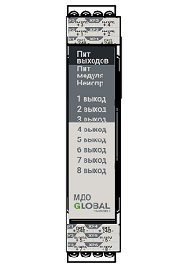

# Составные модули

Составные модули размещаются на внутренней DIN-рейке ГК, расположенной под [верхней крышкой](#верхняя-крышка)

## Модуль центрального процессора

МЦП обеспечивает основной функционал ГК. Для защиты от системной ошибки, приводящей к неисправности ГК, вызванной полным или частичным отказом МЦП, предусмотрена возможность его резервирования путем добавления дополнительного модуля МЦП в состав ГК. ГК в своем составе имеет как минимум один МЦП.

## Модуль кольцевых адресных линий связи

МКА предназначен для увеличения количества подключаемых к ГК [АЛС](#адресная-линия-связи), что позволяет увеличить количество подключенных [адресных устройств](#Список-совместимых-адресных-устройств).

## Модуль дискретных входных сигналов с контролем цепи

МДИ предназначен для приема дискретных электрических сигналов. МДИ осуществляет автоматический контроль исправности [ВхЛС](#входная-дискретная-линия-связи) на обрыв и короткое замыкание.

## Модуль дискретных выходных сигналов с контролем цепи

МДО предназначен для передачи дискретных электрических сигналов. МДО осуществляет автоматический контроль исправности [ВыхЛС](#выходная-дискретная-линия-связи) на обрыв и короткое замыкание.
